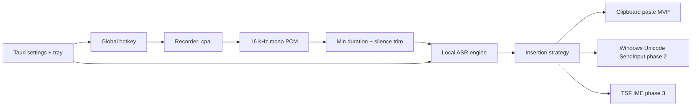

# VoxType Solution Analysis

Last updated: 2026-05-26

## Option A: Rust + Tauri 2 + React/TS Native MVP

Build the app as a small Tauri desktop utility. Rust owns hotkey state, microphone capture, ASR integration, insertion, config, and tray behavior. React owns settings and non-critical UI.

Pros:

- Matches the original draft and the strongest comparable projects, especially Handy and OpenLess.
- Good fit for Windows native APIs without adding a Python runtime.
- Smaller distribution than Electron.
- Keeps a path open to `cpal`, `SendInput`, TSF, ONNX Runtime, whisper.cpp, or sherpa-onnx.
- Best long-term fit for an Apache-2.0 open source Windows utility.

Cons:

- More initial systems work than a Python prototype.
- ASR binding choice needs careful evaluation.
- Windows text insertion still requires native edge-case work.

Recommendation: Use this for the real project.

## Option B: Python + faster-whisper Prototype

Implement a quick utility using Python audio, hotkey, faster-whisper, and clipboard insertion.

Pros:

- Fastest path to prove dictation quality and UX.
- Many reference implementations exist.
- Easier to experiment with ASR models.

Cons:

- Desktop packaging is heavier and more fragile.
- Native Windows input and permissions become awkward.
- Long-term maintenance is less aligned with a polished open source Windows app.

Recommendation: Use only for throwaway experiments if needed, not as the main codebase.

## Option C: Electron/Node Desktop App

Use Electron for UI and native helpers for audio/hotkey/insertion.

Pros:

- Large ecosystem and quick UI iteration.
- OpenWhispr demonstrates a rich product can be built this way.

Cons:

- Runtime size and memory overhead conflict with a lightweight input utility.
- Native helpers are still required for the hard parts.
- The product can drift toward a large assistant instead of a focused input method.

Recommendation: Do not use for VoxType MVP.

## Option D: Full Windows TSF IME First

Build VoxType as a real Windows input method using TSF from the start.

Pros:

- Best theoretical text insertion fidelity.
- More accurate positioning in IME-aware applications.
- Strong foundation for a true input method identity.

Cons:

- High implementation complexity.
- Slow first iteration.
- Requires substantial Windows native testing and installer work.

Recommendation: Keep as a later phase after the product proves the dictation loop.

## Recommended MVP Architecture

Recommended first build:

- Shell: Tauri 2 + React/TypeScript.
- Core: Rust modules for hotkey, recorder, ASR engine adapter, insertion, config, and status events.
- Hotkey: use a proven global hotkey crate or Tauri plugin first; add Windows low-level hook only if needed.
- Audio: `cpal`, normalized to 16 kHz mono PCM.
- VAD: start with minimum duration and silence trimming; add Silero/ONNX VAD after the core loop works.
- ASR: compare whisper.cpp/transcribe-rs versus sherpa-onnx before hard-locking. `whisper-cli` can be a proof-of-life path, but should not become the permanent boundary.
- Insertion: clipboard paste plus restoration for MVP, then `SendInput(KEYEVENTF_UNICODE)`, then TSF only when needed.
- UI: tray, settings page, small non-focus-stealing status indicator.

## Final Recommendation

Choose Option A. Build a narrow Windows-first Tauri/Rust MVP that proves one loop: hold, speak, release, local transcribe, insert. Borrow architecture lessons from Handy and OpenLess, pipeline details from faster-whisper-dictation, and avoid copying GPL/AGPL code. Delay TSF, meeting transcription, and AI formatting until the basic dictation loop is reliable.

