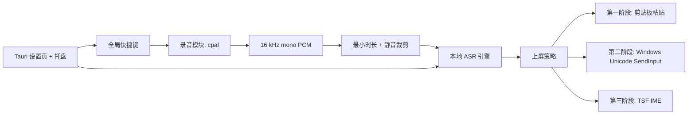

# VoxType 方案分析中间稿

更新时间：2026-05-26

## 方案 A：Rust + Tauri 2 + React/TS 原生 MVP

用 Tauri 做轻量桌面壳。Rust 负责快捷键状态、麦克风录音、ASR 集成、文本上屏、配置和托盘；React 负责设置页和非关键 UI。

优点：

- 符合原始草稿，也符合 Handy 和 OpenLess 这两个强相关项目的方向。
- 适合接 Windows native API，不需要打包 Python runtime。
- 比 Electron 更轻。
- 未来可以接 `cpal`、`SendInput`、TSF、ONNX Runtime、whisper.cpp 或 sherpa-onnx。
- 最适合作为 Apache-2.0 的长期 Windows 开源工具。

缺点：

- 初期系统工程量比 Python 原型更高。
- ASR binding 需要认真评估。
- Windows 文本上屏仍然要处理很多 native 边界情况。

结论：推荐作为主项目路线。

## 方案 B：Python + faster-whisper 快速原型

用 Python 音频库、快捷键库、faster-whisper 和剪贴板上屏快速做出一个工具。

优点：

- 最快验证 ASR 质量和用户体验。
- 参考项目多。
- 方便试模型。

缺点：

- 桌面分发更重、更脆弱。
- Windows native 输入和权限处理会变别扭。
- 长期维护不如 Rust/Tauri 适合。

结论：可以作为一次性实验，不建议作为主代码库。

## 方案 C：Electron/Node 桌面应用

用 Electron 做 UI，再用 native helper 处理音频、快捷键和上屏。

优点：

- UI 生态成熟。
- OpenWhispr 证明复杂语音产品可以这样做。

缺点：

- 体积和内存占用偏大，不符合轻量输入工具定位。
- 难点仍然要靠 native helper 解决。
- 容易演变成大而全语音助手，而不是聚焦输入法。

结论：不建议用于 VoxType MVP。

## 方案 D：第一版直接做完整 Windows TSF IME

一开始就把 VoxType 做成真正的 Windows 输入法。

优点：

- 理论上文本上屏最可靠。
- 更适合 IME-aware 应用。
- 对“真正输入法”身份更完整。

缺点：

- 实现复杂度高。
- 第一轮反馈会很慢。
- 安装、测试、Windows native 边界都会变重。

结论：后置。先证明产品闭环，再考虑 TSF。

## 推荐 MVP 架构

建议第一版：

- 桌面壳：Tauri 2 + React/TypeScript。
- 核心：Rust 模块拆分为 hotkey、recorder、ASR engine adapter、insertion、config、status events。
- 快捷键：先用成熟的 global hotkey crate 或 Tauri plugin，不够再补 Windows low-level hook。
- 音频：`cpal`，统一到 16 kHz mono PCM。
- VAD：先做最小时长和静音裁剪；第二阶段再加 Silero/ONNX VAD。
- ASR：先比较 whisper.cpp/transcribe-rs 和 sherpa-onnx。`whisper-cli` 可以做 proof-of-life，但不建议成为长期核心边界。
- 上屏：第一阶段剪贴板粘贴并恢复，第二阶段 `SendInput(KEYEVENTF_UNICODE)`，第三阶段 TSF。
- UI：托盘、设置页、不抢焦点的小状态提示。

最终建议：选择方案 A。先做窄范围 Windows-first Tauri/Rust MVP，证明“按住、说话、松开、本地转写、上屏”的闭环。借鉴 Handy 和 OpenLess 的架构边界，借鉴 faster-whisper-dictation 的管线细节，不复制 GPL/AGPL 代码。TSF、会议转写、AI 格式化都后置。

