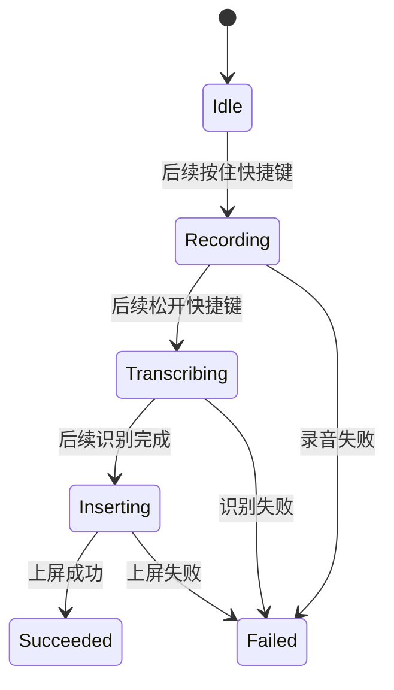
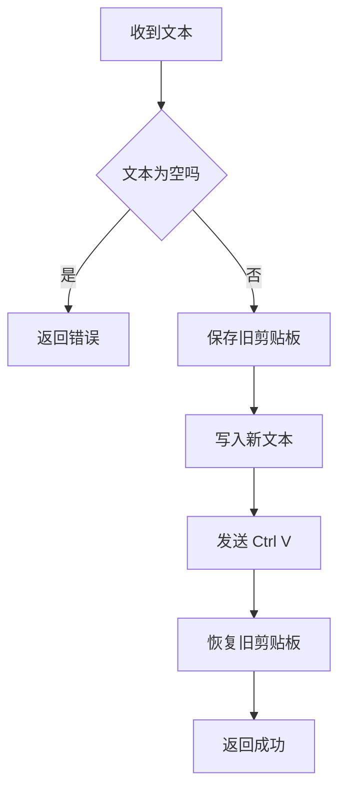
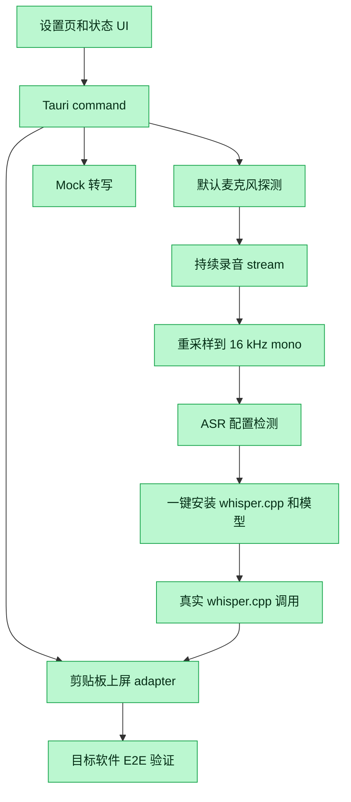

# VoxType 代码导读

本文面向 Rust 和 Tauri 新手，按“从用户点击按钮到 Rust 执行”的顺序解释当前代码。它不是完整 Rust 教程，只解释你读本仓库时马上会遇到的概念。

## 先看哪几个文件

建议按这个顺序读：

1. `src/App.tsx`：先看用户界面和按钮点击后发生什么。
2. `src/tauriClient.ts`：看前端怎样调用 Rust。
3. `src-tauri/src/lib.rs`：看 Rust 暴露了哪些 Tauri command。
4. `src-tauri/src/state.rs`：看状态是怎么表示的。
5. `src-tauri/src/config.rs`：看默认配置是什么。
6. `src-tauri/src/recorder.rs`：看麦克风信息、录音 stream 和音频 buffer。
7. `src-tauri/src/asr/mod.rs`：看 mock ASR 和 whisper.cpp adapter。
8. `src-tauri/src/insertion/mod.rs`：看剪贴板上屏。
9. `src-tauri/src/tray.rs`：看系统托盘。

## 一次按钮点击怎么走


关键理解：前端不直接碰系统能力。凡是麦克风、剪贴板、托盘、whisper.cpp 这类能力，都要通过 Tauri 调 Rust。

## `src/App.tsx`

这是当前主界面。

它维护几类状态：

| 状态 | 类型 | 用途 |
|---|---|---|
| `config` | `AppConfig` | 显示快捷键、语言、ASR、上屏策略 |
| `status` | `AppStatus` | 显示当前阶段和最后一次转写文本 |
| `recorderInfo` | `RecorderInfo` | 显示默认麦克风信息 |
| `inputDevices` | `RecorderInfo[]` | 显示可选择的输入设备列表 |
| `runtimeMessage` | `string` | 告诉你当前是浏览器模式还是 Tauri 模式 |
| `diagnostics` | `DiagnosticEntry[]` | 显示每一步成功/失败和原因 |

当前关键按钮：

- `handleSimulateDictation`：调用 mock 听写闭环。
- `handleClipboardInsert`：调用剪贴板上屏。
- `handleStartRecording` / `handleStopRecording`：启动和停止真实录音采集。
- `handleTranscribeLastRecording`：把最近一次录音交给 whisper.cpp 转写。
- `handleTranscribeAndInsert`：先转写，再给维护者 3 秒切回目标输入框，然后上屏。
- `handleExportLastRecordingWav`：把最近一次 ASR 输入导出为 WAV，用来复盘识别质量问题。

浏览器模式和 Tauri 模式的区别在这里判断：

```ts
isTauriRuntime()
```

如果不是 Tauri 模式，就不能测麦克风、托盘、剪贴板真实上屏。

## `src/tauriClient.ts`

这个文件是前端到 Rust 的唯一入口封装。

```ts
export async function simulateDictation(): Promise<AppStatus> {
  return invoke<AppStatus>('simulate_dictation');
}
```

这段代码的意思：请求 Tauri 调 Rust 里名叫 `simulate_dictation` 的 command，并期待它返回 `AppStatus`。

好处是 `App.tsx` 不需要到处写字符串形式的 command 名称。

## `src-tauri/src/lib.rs`

这是 Rust 侧的 Tauri command 总入口。

当前 command：

| Command | 前端函数 | 当前作用 |
|---|---|---|
| `get_config` | `getConfig` | 返回默认配置 |
| `get_status` | `getStatus` | 返回空闲状态 |
| `simulate_dictation` | `simulateDictation` | mock ASR + mock insertion |
| `get_default_input_info` | `getDefaultInputInfo` | 读取默认麦克风信息 |
| `list_input_devices` | `listInputDevices` | 读取所有可用输入设备 |
| `set_input_device` | `setInputDevice` | 选择后续录音使用的输入设备 |
| `start_recording` | `startRecording` | 打开输入设备并开始采集 |
| `stop_recording` | `stopRecording` | 停止采集并生成 ASR 输入 |
| `transcribe_last_recording` | `transcribeLastRecording` | 用 whisper.cpp 转写最近录音 |
| `export_last_recording_wav` | `exportLastRecordingWav` | 导出最近录音的 16 kHz WAV |
| `insert_text_with_clipboard` | `insertTextWithClipboard` | 用剪贴板尝试上屏 |

Tauri 通过这段注册 command：

```rust
.invoke_handler(tauri::generate_handler![
    get_config,
    get_status,
    simulate_dictation,
    get_default_input_info,
    insert_text_with_clipboard
])
```

如果前端调用的名字没有在这里注册，就会调用失败。

## `state.rs`

`state.rs` 定义应用状态。



当前真实代码里已经有这些状态枚举，但 UI 主要用到了 `idle`、`succeeded`、`failed`。

## `config.rs`

`config.rs` 定义默认配置：

```rust
hotkey: "Ctrl+Alt+Space"
language: "zh-CN"
asr_engine: "whisper.cpp"
insertion_strategy: "clipboard"
```

现在它只是默认值，还没有接本地配置文件保存。后续设置页需要能修改这些值并持久化。

## `recorder.rs`

这个模块目前做三件事。

第一，读取默认麦克风信息：

```rust
pub fn default_input_info() -> Result<RecorderInfo, VoxError>
```

它使用 `cpal`：

- 找默认输入设备。
- 读取默认输入配置。
- 返回设备名、采样率、声道数。

第二，处理音频 buffer：

```rust
pub fn normalize_to_mono_i16(input: &[i16], channels: u16, sample_rate: u32) -> RecordingBuffer
```

如果输入是双声道，它会把左右声道平均成单声道。whisper.cpp MVP 通常希望我们给它稳定的 mono PCM。

第三，列出和选择输入设备：

```rust
pub fn list_input_devices() -> Result<Vec<RecorderInfo>, VoxError>
RecorderManager::set_input_device(...)
```

如果系统默认设备是 `Remote Audio` 这类远程音频设备，识别结果可能只返回 `(音)`。所以 UI 现在允许先切换到真实麦克风，再开始录音。

第四，管理真实录音 stream：

```rust
RecorderManager::start()
RecorderManager::stop()
RecorderManager::status()
```

`start()` 会用 `cpal` 打开默认输入设备，创建输入 stream，并把收到的音频帧写入 `RecordingSession`。

`stop()` 会停止 stream，并返回 `RecordedAudio`：

- `samples`：采集到的 mono PCM 样本。
- `sampleRate`：实际输入采样率，例如 `44100`。
- `channels`：停止后 buffer 的声道数，当前会归一成 `1`。
- `sampleCount`：样本数量。
- `durationMs`：按采样率计算出的录音时长。
- `asrSampleRate`：准备给 ASR 的目标采样率，当前是 `16000`。
- `asrSampleCount`：重采样后的 ASR 样本数量。
- `asrDurationMs`：按 `16000 Hz` 计算的 ASR 输入时长。

当前已经可以通过 `transcribe_last_recording` 把最近一次录音的 `16 kHz` ASR 输入交给 `WhisperCppEngine`。它优先使用应用内保存的 ASR 配置；如果应用内没有保存路径，再用环境变量作为开发者兜底。

`export_last_recording_wav` 会把最近一次 `16 kHz` ASR 输入写成 `last-asr-input.wav`。这个文件不提交到仓库，只用于调试：如果文件里听不到人声，问题在输入设备或录音；如果听得到人声但识别差，问题更可能在模型或 ASR 参数。

## `asr_config.rs`

这个模块专门管理 whisper.cpp 的本机配置。它不负责下载模型，也不负责转写，只回答三个问题：

1. 当前 `whisper-cli.exe` 路径是什么。
2. 当前模型文件路径是什么。
3. 这两个路径是否存在，是否已经可以调用真实 ASR。

核心类型：

| 类型 | 作用 |
|---|---|
| `AsrConfig` | 用户保存的配置：binary 路径、model 路径、语言 |
| `AsrConfigStatus` | 给前端展示的检测结果：是否配置、文件是否存在、是否 ready、中文提示 |

读取优先级：

1. 应用内 JSON 配置。
2. 环境变量 `VOXTYPE_WHISPER_CPP_BINARY`、`VOXTYPE_WHISPER_CPP_MODEL`、`VOXTYPE_ASR_LANGUAGE`。
3. 默认语言 `zh`。

这样做是为了让普通用户在界面里保存路径，同时保留开发者用环境变量快速实验的能力。

## `asr_installer.rs`

这个模块负责“一键安装 whisper.cpp”。它不参与转写，只负责把外部依赖准备好，并把结果写回 `asr_config.rs`。

当前默认安装：

| 文件 | 来源 | 安装到 |
|---|---|---|
| `whisper-bin-x64.zip` | `ggml-org/whisper.cpp` GitHub Release | 应用数据目录的 `managed-asr/whisper.cpp/downloads/` |
| `whisper-cli.exe` | 从 ZIP 解压 | 应用数据目录的 `managed-asr/whisper.cpp/bin/` |
| `ggml-base.bin` | `ggerganov/whisper.cpp` Hugging Face 仓库 | 应用数据目录的 `managed-asr/whisper.cpp/models/` |

## `insertion/mod.rs`

这个模块负责把文字送进目标输入框。当前 MVP 使用剪贴板策略：

1. 用 `arboard` 打开系统剪贴板。
2. 写入本次识别文本。
3. 读回剪贴板确认写入成功。
4. 等待一个很短的时间，让系统剪贴板状态稳定。
5. 用 `enigo` 发送 `Ctrl+V`。

早期版本会在发送 `Ctrl+V` 后马上恢复旧剪贴板。维护者实测发现目标软件可能还没读取新剪贴板，旧剪贴板就被恢复了，导致实际粘贴的是上一次手动复制的内容。因此当前 MVP 暂时不自动恢复旧剪贴板，优先保证上屏可靠性。

安装完成后，模块会调用 `save_asr_config`，所以前端不需要知道真实文件保存在哪里。

## `asr/mod.rs`

ASR 是 Automatic Speech Recognition，也就是语音识别。

这个模块有一个接口：

```rust
pub trait AsrEngine {
    fn transcribe(&self, pcm_16khz_mono: &[i16]) -> Result<Transcript, VoxError>;
}
```

当前两个实现：

| 实现 | 作用 |
|---|---|
| `MockAsrEngine` | 不识别真实音频，直接返回固定中文文本 |
| `WhisperCppEngine` | 准备调用 whisper.cpp CLI 做真实识别 |

`WhisperCppEngine` 当前做了这些边界工作：

1. 检查 whisper.cpp 可执行文件是否存在。
2. 检查模型文件是否存在。
3. 把 PCM 写成临时 WAV。
4. 调用 whisper.cpp CLI。
5. 从 stdout 读取转写文本。

现在 `transcribe_last_recording` 已经会从 `asr_config.rs` 取得 binary/model 路径。`transcribe_last_recording_and_insert` 会在真实转写完成后调用剪贴板上屏 adapter，形成“最近录音 -> 转写 -> 上屏”的 proof-of-life。

## `insertion/mod.rs`

Insertion 指“文本上屏”，也就是把识别出来的文字输入到当前光标位置。

当前有两种实现：

| 实现 | 作用 |
|---|---|
| `MockInsertion` | 测试用，只检查文本不是空 |
| `ClipboardInsertion` | Windows 上用剪贴板 + `Ctrl+V` 尝试上屏 |

`ClipboardInsertion` 的流程：



注意：返回成功只说明程序发送了粘贴动作，不保证目标软件一定收到文字。目标软件是否收到，取决于当时焦点在哪里。

## `tray.rs`

托盘模块创建两个菜单：

- `打开设置`
- `退出`

点击 `打开设置` 会显示并聚焦主窗口。点击 `退出` 会关闭应用。

## `error.rs`

这个模块把 Rust 内部错误统一成前端能理解的错误。

例如：

```rust
VoxError::Recorder("没有找到默认输入设备".to_string())
```

会变成前端能显示的错误信息。这样 UI 不需要理解 Rust 的内部错误类型。

## 当前代码和第一版 MVP 状态



第一版 MVP proof-of-life 已经跑通：录音、16 kHz ASR 输入、whisper.cpp 转写、延迟切回目标输入框后的剪贴板上屏都已经被维护者手动验证。下一阶段不再是“能不能跑通”，而是把它做得更像日常工具：输出默认简体中文、增加全局快捷键、持久化输入设备选择、支持模型选择/下载进度，并继续提高上屏可靠性。
