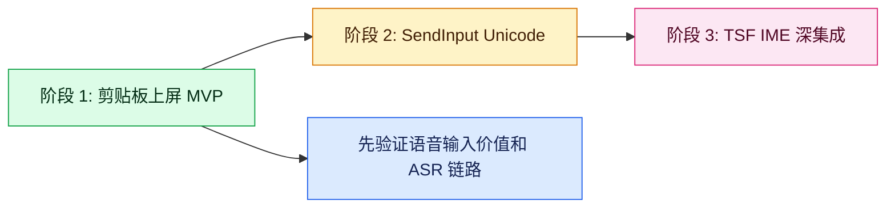
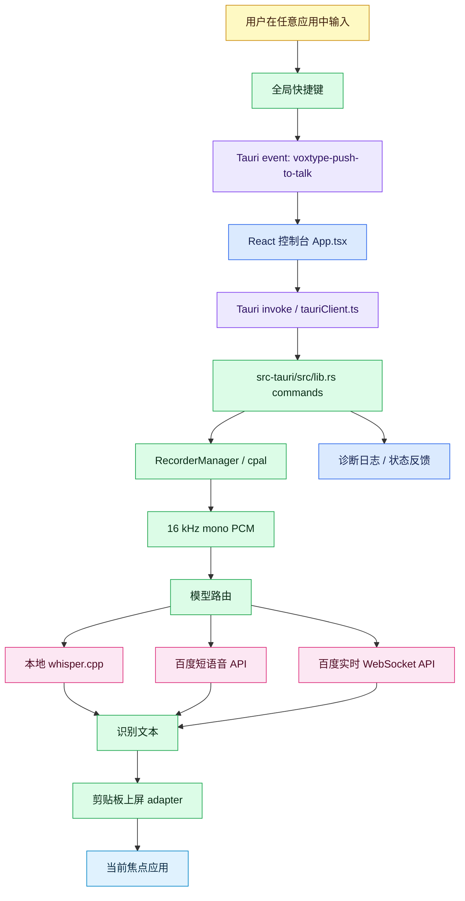
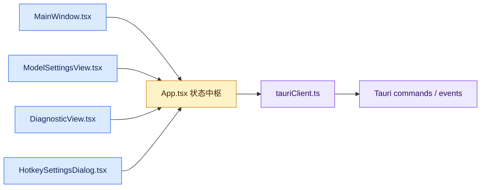
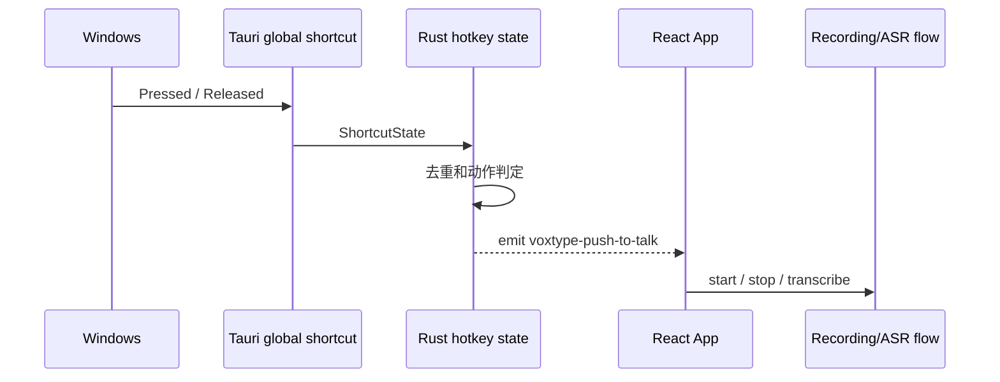
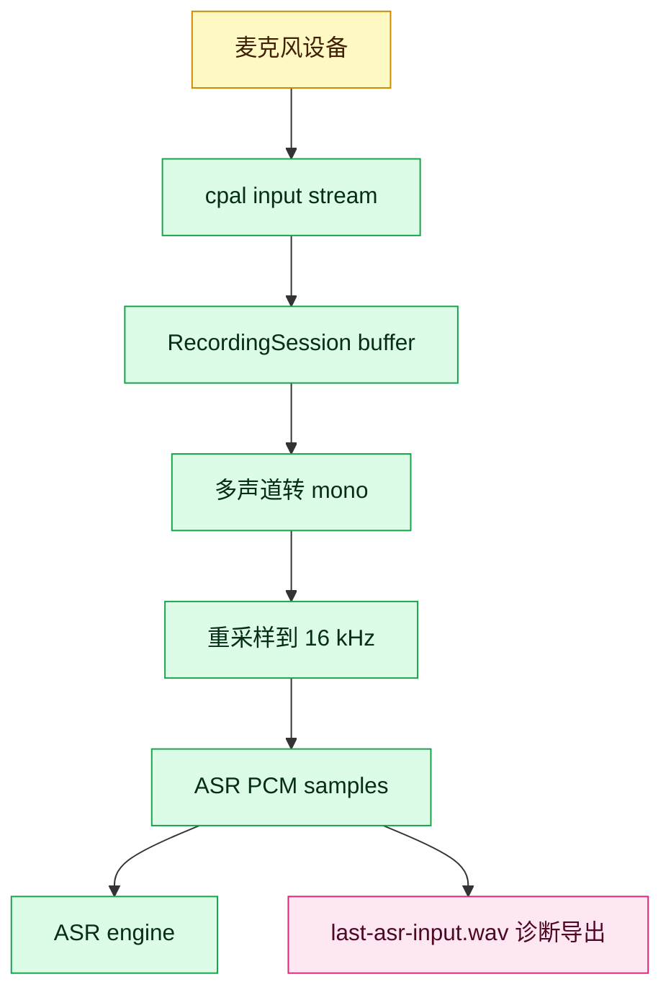
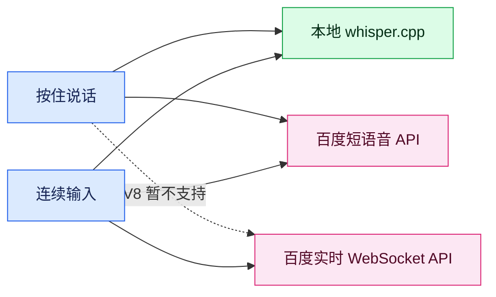
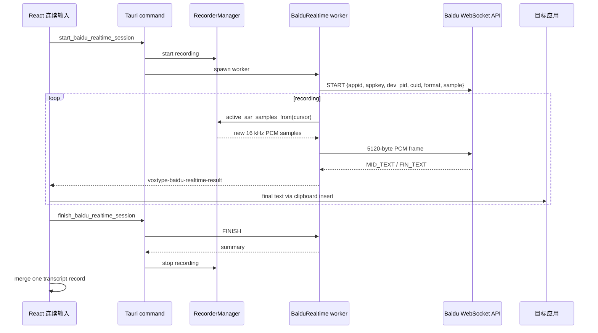
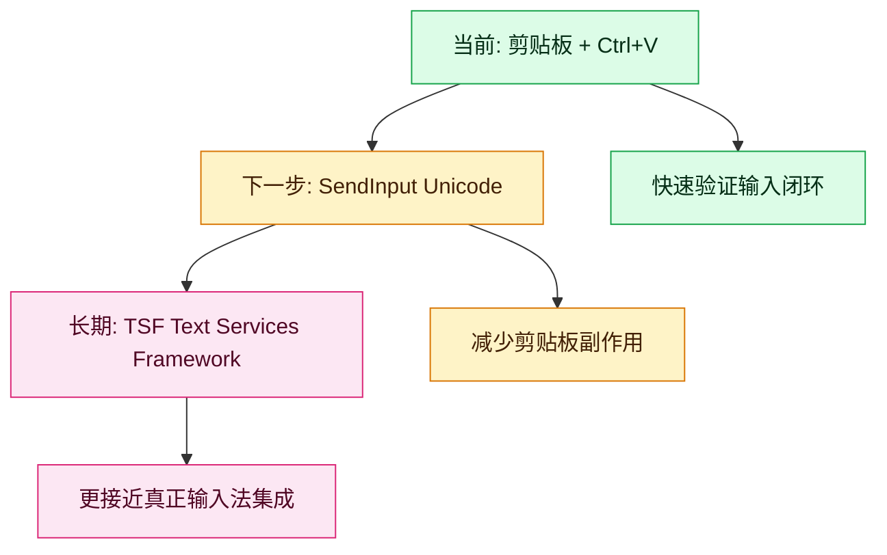
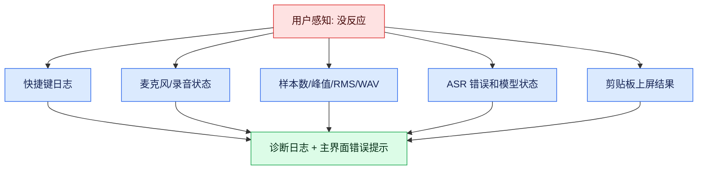
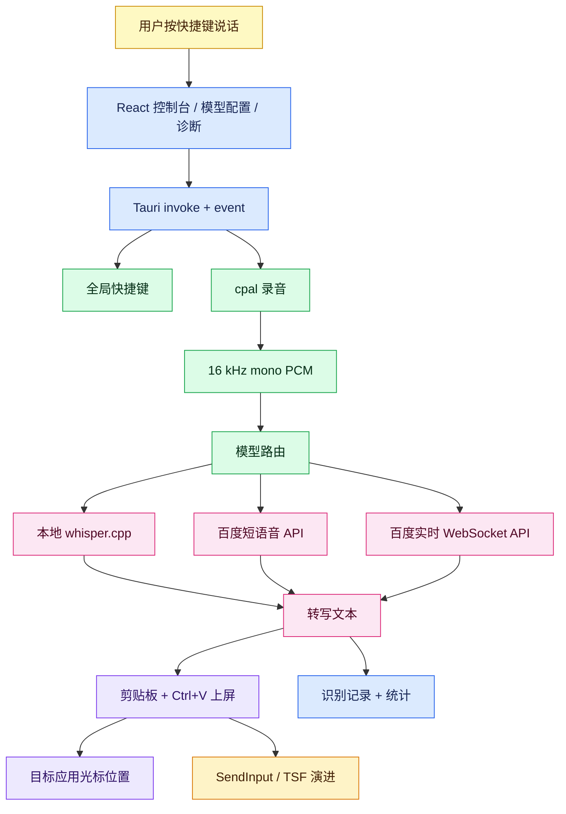

# VoxType 面试项目讲解稿

> 用途：面试“输入法 / Windows 客户端 / 语音输入 / Rust 桌面应用”岗位时，用这份文档快速讲清楚 VoxType 的背景、技术栈、架构、关键实现、亮点、踩坑和后续规划。
>
> 当前项目状态：VoxType 是一个本地优先的语音输入工具原型，已经跑通 Windows 桌面端的快捷键、录音、ASR、上屏、诊断、模型选择和百度实时 WebSocket API 连续输入链路。它还不是完整 TSF 输入法，但已经具备语音输入法核心闭环。

## 0. Current Update For Interviews

V8 is closed and manually verified on the real Windows desktop app. Baidu Realtime WebSocket API continuous input works as a real streaming ASR path: target-app insertion is driven by Baidu `FIN_TEXT` final events, while `MID_TEXT` partial events are status-only and are not inserted into the target app. This distinction is useful in interviews because it shows the project separates real provider streaming from simulated typing and avoids unstable partial-text rewrites.

The V8 overlay follow-up is also closed. The small capsule overlay border was visually clipped at the bottom because both the native Win32 overlay and WebView fallback used a `120 x 32` viewport and drew antialiased capsule pixels directly at the transparent window edge. The fix increased the viewport to `120 x 36` while keeping the visual capsule about `120 x 32`, leaving transparent padding for the border pixels.

V9 is planned as transcript quality plus local history persistence. It will add deterministic glossary/replacement rules such as `scale => skill`, provider-neutral post-processing for local whisper.cpp, Baidu Short Speech API, and Baidu Realtime WebSocket API final text, and durable recognition history across app restarts. The persisted history should keep final text, input mode, model, duration, character count, timestamp, and post-processing metadata. V9 intentionally does not start with SendInput/TSF or LLM rewriting.

## 1. 一分钟项目介绍

VoxType 是一个用 Rust + Tauri 2 + React/TypeScript 实现的桌面语音输入工具。它的目标是让用户在任意 Windows 应用中按快捷键说话，系统自动录音、识别成文字，并把文字输入到当前光标位置。

这个项目不是简单的网页 Demo，而是围绕输入法真实难点做了工程化验证：全局快捷键、麦克风采集、16 kHz PCM 音频标准化、本地 whisper.cpp、百度短语音 API、百度实时 WebSocket API、剪贴板上屏、桌面浮窗、诊断日志、模型配置、密钥保护和自动化测试。

面试时可以这样概括：

> “我做的是一个本地优先的语音输入法原型。前端用 React 做控制台和配置页，系统能力都放在 Rust/Tauri 侧，包括全局快捷键、录音、ASR 调用和文本上屏。项目重点不是 UI Demo，而是验证输入法链路：用户按快捷键说话，录音变成 16 kHz mono PCM，走本地或云端 ASR，最后把文字上屏到目标应用。后续可以继续演进到 SendInput 或 TSF 级别的真正输入法集成。”

## 2. 项目目标与边界

### 已完成的核心闭环

- `Ctrl+Alt+Space`：按住说话，松开后停止录音、识别、上屏。
- `Ctrl+Alt+V`：连续输入，第一次按开始录音，第二次按停止；本地模式支持分段转写，百度实时 WebSocket 模式支持 final 片段实时上屏。
- 支持本地 `whisper.cpp`、百度短语音 API、百度实时 WebSocket API 三种模型入口。
- 主界面显示准备状态、输入模式、识别记录、统计数据、模型元信息。
- 诊断页可以排查麦克风、快捷键、浮窗、ASR、上屏、最近录音 WAV。

### 明确没有把 MVP 做成完整 TSF 输入法

第一版没有直接做 TSF IME。原因是 TSF 涉及安装、文本服务、候选窗口、组合串、权限边界和大量兼容性测试，容易在产品价值还没验证前陷入系统集成复杂度。VoxType 先用 Tauri + 剪贴板上屏跑通语音输入核心闭环，再逐步升级上屏层。

## 3. 技术栈

| 层 | 技术 | 项目中承担的职责 |
| --- | --- | --- |
| 桌面壳 | Tauri 2 | 提供 Windows 桌面窗口、系统托盘、前后端 command bridge |
| 前端 | React 19 + TypeScript + Vite | 主控制台、模型选择配置、诊断页、识别记录、状态展示 |
| 系统核心 | Rust | 快捷键、录音、ASR adapter、上屏、配置、错误处理 |
| 快捷键 | `tauri-plugin-global-shortcut` | 注册 `Ctrl+Alt+Space`、`Ctrl+Alt+V`，把按下/松开事件发给前端 |
| 音频采集 | `cpal` | 选择输入设备、录音、采样率/声道信息、录音状态 |
| 本地 ASR | whisper.cpp CLI adapter | 把 16 kHz PCM 写临时 WAV，调用 `whisper-cli` 转写 |
| 云端 ASR | `reqwest` + 百度短语音 API | OAuth access token + JSON/base64 PCM 请求 |
| 实时 ASR | `tungstenite` + 百度 WebSocket API | START/PCM frame/FINISH/CANCEL/HEARTBEAT 流式识别 |
| 文本上屏 | `arboard` + `enigo` | 写剪贴板、模拟 `Ctrl+V` |
| 浮窗 | Tauri WebView fallback + Win32 native overlay | 显示录音/转写状态动效 |
| 测试 | Vitest + Rust tests | 前端交互、状态、协议序列化、音频分帧、配置校验 |

## 4. 总体架构

VoxType 的架构核心是：React 只做控制面，Rust 才是可信系统能力层。前端不会直接访问麦克风、快捷键或剪贴板，而是通过 Tauri command 调用 Rust。

这个分层有几个好处：

- 系统能力集中在 Rust，减少浏览器环境差异。
- 前端可以用测试和 mock 覆盖 UI 状态流，不需要真的开麦克风。
- ASR 引擎通过 adapter 和模型路由隔离，后续可以替换为 sherpa-onnx、Whisper streaming 或 TSF。
- 每个边界都有诊断信息，出现“没有反应”时可以定位是快捷键、录音、ASR 还是上屏失败。

## 5. 关键模块拆解

### 5.1 前端控制面

主要文件：

- `src/App.tsx`：应用状态中枢，处理快捷键事件、录音启动停止、ASR 调用、上屏、记录合并。
- `src/MainWindow.tsx`：用户主界面，显示输入模式、准备状态、识别记录、统计信息。
- `src/ModelSettingsView.tsx`：模型选择和模型配置页，支持按住说话模型、连续输入模型分别持久化。
- `src/DiagnosticView.tsx`：诊断工作台。
- `src/tauriClient.ts`：封装所有 Tauri command 和 event listener。
- `src/types.ts`：前后端共享的 TypeScript 类型。

前端的关键设计是把“用户操作”和“系统能力”分开。按钮和快捷键触发的是 `App.tsx` 的流程函数，真正系统调用都经过 `tauriClient.ts`。

### 5.2 Rust command 总入口

主要文件：`src-tauri/src/lib.rs`

`lib.rs` 是 Tauri command 的注册点。前端调用的能力都在这里暴露，例如：

- `start_recording` / `stop_recording`
- `transcribe_last_recording`
- `insert_text_with_clipboard`
- `save_hotkey_preferences`
- `save_mode_model_preferences`
- `start_baidu_realtime_session`
- `finish_baidu_realtime_session`

面试可以强调：这个文件不是把所有业务都写在一起，而是 command gateway。真正的业务分散在 `recorder.rs`、`asr`、`cloud_asr.rs`、`baidu_realtime.rs`、`insertion` 等模块。

### 5.3 快捷键状态机

主要文件：`src-tauri/src/hotkey.rs`、`src-tauri/src/lib.rs`

项目支持两个快捷键：

- 按住说话：`Ctrl+Alt+Space`
- 连续输入：`Ctrl+Alt+V`

快捷键事件从 OS 到 Rust，再通过 Tauri event 发给 React。这样做的原因是快捷键回调不适合直接做耗时 ASR，否则会阻塞全局快捷键处理。React 收到事件后再走统一业务流程。

### 5.4 录音与音频标准化

主要文件：`src-tauri/src/recorder.rs`、`src-tauri/src/audio.rs`

录音模块用 `cpal` 打开系统输入设备，采集音频帧，转换成 mono i16 buffer。停止录音时会输出两份关键信息：

- 原始录音统计：采样率、样本数、峰值、RMS、时长。
- ASR 输入：重采样后的 16 kHz mono PCM。

这个设计让问题可诊断：如果录音 WAV 里没有人声，问题在设备或权限；如果 WAV 正常但识别差，问题更可能在模型、语言、ASR 参数或云端服务。

### 5.5 ASR 模型路由

VoxType 当前把模型分成三类：

| 模型 | 适合模式 | 当前作用 |
| --- | --- | --- |
| 本地 whisper.cpp | 按住说话 / 连续输入 | 本地优先，不上传音频；CLI adapter 调用 `whisper-cli` |
| 百度短语音 API | 按住说话 / 连续输入 | 停止后整段上传 16 kHz PCM，返回完整文本 |
| 百度实时 WebSocket API | 连续输入 | 边录边发送 PCM frame，final 片段实时上屏 |

前端允许“按住说话模型”和“连续输入模型”分别配置。这个设计来自真实使用场景：按住说话适合短句，停止后整段识别就够了；连续输入更接近长句或持续输入，实时 WebSocket 更适合。

### 5.6 百度短语音 API

主要文件：`src-tauri/src/cloud_asr.rs`、`src-tauri/src/cloud_asr_config.rs`

短语音 API 的路径是停止录音后整段识别。实现要点：

1. 从用户环境变量读取 `BAIDU_ASR_API_KEY` 和 `BAIDU_ASR_SECRET_KEY`。
2. 请求百度 OAuth `access_token`。
3. 把 16 kHz PCM 转成 little-endian bytes，再 base64 放入 JSON 的 `speech` 字段。
4. 请求 `http://vop.baidu.com/server_api`。
5. 解析 `result[0]` 作为识别文本。

这里的密钥处理是一个面试亮点：API Key 和 Secret Key 只写入用户环境变量，项目配置、日志、测试快照和文档都不保存真实值。

### 5.7 百度实时 WebSocket API

主要文件：`src-tauri/src/baidu_realtime.rs`

这是 V8 的重点。实现遵循百度官方实时语音识别 WebSocket 文档：

- endpoint：`wss://vop.baidu.com/realtime_asr`
- START frame：顶层 `type: "START"`，嵌套 `data`
- `data` 字段：`appid`、`appkey`、`dev_pid`、`lm_id`、`cuid`、`user`、`format`、`sample`
- 音频格式：16 kHz、16-bit、mono、PCM
- 分帧：160 ms，也就是 2560 个 i16 sample，5120 bytes
- 控制帧：`FINISH`、`CANCEL`、`HEARTBEAT`

一个重要细节是停止流程。最初的风险是：停止时如果先走普通 `stopRecording()`，就不会调用实时 WebSocket 的 `FINISH`，导致 session 无法正常收尾。现在的设计是连续输入模型为 `baidu-realtime` 时，停止分支先调用 `finish_baidu_realtime_session`，再合并记录。

## 6. 文本上屏策略

当前实现用剪贴板上屏：

1. 写入识别文本到剪贴板。
2. 用 `enigo` 模拟 `Ctrl+V`。
3. 通过延迟确保目标应用有时间消费粘贴事件。

为什么先用剪贴板：

- 实现成本低，适合 MVP 快速验证。
- 对大多数文本框有效。
- 便于把重点放在快捷键、录音和 ASR 链路上。

当前局限：

- 会占用用户剪贴板。
- 受目标应用粘贴策略影响。
- 跨权限窗口、远程桌面、安全软件场景可能失败。

后续升级方向：

## 7. 桌面浮窗与主界面设计

VoxType 有两类 UI：

- 主窗口：控制中心，显示准备状态、输入模式、模型、识别记录。
- 桌面浮窗：录音/转写期间的轻量状态反馈。

浮窗经历过一个典型 Windows 桌面问题：Tauri/WebView2 透明窗口在 Windows 上容易露出白/灰矩形边框。项目最后引入 `native-win32` 后端，用 Win32 popup + layered window 绘制胶囊浮窗，绕开 WebView 透明窗口宿主层限制。

这部分可以体现对平台限制的判断：不是所有视觉问题都能靠 CSS 修复，桌面客户端需要知道什么时候下沉到 native API。

## 8. 诊断与可观测性

VoxType 做了比较多诊断设计，因为输入法类项目最怕“按了没反应”。项目把失败分层暴露：

- 快捷键是否注册成功。
- 麦克风设备是否可用。
- 录音是否有样本、峰值和 RMS。
- ASR 配置是否完整。
- 真实 ASR 请求是否返回 HTTP/API 错误。
- 上屏是否执行。
- 最近 ASR 输入可导出为 WAV。

面试时可以说：我没有只做 happy path，而是从“输入法调试很难”的角度，把用户不可见的链路状态都显式化，方便定位问题。

## 9. 项目亮点

### 9.1 系统能力放 Rust，UI 放 React

这个边界清晰：React 做配置和状态，Rust 做快捷键、录音、ASR 和上屏。既保留了前端开发效率，也减少了系统能力散落在 UI 里的风险。

### 9.2 输入模式和模型路由分离

按住说话和连续输入可以选择不同模型。这比“全局一个模型”更贴近真实语音输入场景：短句可以走停止后识别，连续输入更适合实时 WebSocket。

### 9.3 支持本地优先和云端增强

本地 `whisper.cpp` 保护隐私，百度短语音和实时 WebSocket 用于可用性和准确率补强。项目没有把云端作为唯一默认路径。

### 9.4 百度实时 WebSocket 接入按官方协议实现

V8 没有硬猜接口，而是按官方文档做 START frame、PCM 分帧、控制帧和 final/partial 事件解析。

### 9.5 密钥保护

百度 API Key、Secret Key 等敏感输入都使用密码输入框；真实密钥写入用户环境变量，不写入仓库配置、日志、测试或文档。诊断里只出现变量名或脱敏状态。

### 9.6 诊断优先

项目从早期就保留诊断日志、录音 WAV 导出、配置状态、快捷键状态和错误提示。对输入法项目来说，这比只做漂亮 UI 更重要。

## 10. 遇到的问题和解决方式

### 问题 1：Windows WebView 透明浮窗出现白/灰边框

- 现象：Tauri/WebView 浮窗外层出现不应该有的矩形边框。
- 根因：Windows WebView2/Tauri 透明窗口宿主层限制，不是普通 CSS 边框。
- 解决：增加 `native-win32` overlay，用 Win32 popup/layered window 和软件绘制胶囊形态。
- 收获：桌面端不能只用 Web 技术思维，有些问题需要 native fallback。

### 问题 2：快捷键修改后 UI 显示变了但实际不生效

- 现象：设置页保存快捷键后显示更新，但新快捷键没有触发录音。
- 根因：偏好保存、全局快捷键注册和前端状态不是同一条闭环。
- 解决：保存快捷键时先验证组合键，再注销旧快捷键并注册新快捷键；失败时回滚旧绑定并显示错误。
- 收获：配置类功能不能只更新 UI，必须验证底层 runtime 状态。

### 问题 3：连续输入的识别记录被切成很多段

- 现象：连续输入模式每个小片段都进识别记录，历史很碎。
- 根因：录音过程中分段上屏和“本次会话记录”没有分离。
- 解决：final/片段可以实时上屏，但记录层合并为一次连续输入会话，停止时写一条完整记录。
- 收获：实时输出和历史记录是两个不同产品语义。

### 问题 4：百度 ASR 配置显示通过但真实调用 404

- 现象：主界面看起来配置好了，但真实请求报 `HTTP 404 Not Found`。
- 根因：配置检测只检查字段存在，没有检查 endpoint 形状；错误也只在诊断页里，不在主界面暴露。
- 解决：百度短语音 endpoint 必须是 `/server_api`；ASR 失败写入主界面识别记录区域的 status。
- 收获：配置 ready 不能只看“字段非空”，还要做最小语义校验。

### 问题 5：实时 WebSocket 停止时没有调用 FINISH

- 现象：测试中 final 片段能上屏，但第二次快捷键停止没有调用 `finishBaiduRealtimeSession`。
- 根因：实时模式和本地录音模式共用 stop 函数，一进入就调用普通 `stopRecording()`，绕开了实时 session 的 FINISH 流程。
- 解决：在 stop 分支最前面判断模型；`baidu-realtime` 先走 `finish_baidu_realtime_session`，再合并记录。
- 收获：不同模型不只是不同 ASR 函数，它们的生命周期也不同。

### 问题 6：中文文档和代码替换出现乱码

- 现象：部分中文断言和文档段落出现 `????`。
- 根因：Windows PowerShell 5.1 对 UTF-8 中文命令片段按本地代码页解释。
- 解决：后续中文文件查看和替换优先用 Git Bash 或明确 UTF-8 读写；扫描 `???` 和 mojibake；必要时用 ASCII/Unicode escape 写代码。
- 收获：跨平台开发里编码也是工程风险，需要纳入 workflow。

## 11. 当前仍存在的问题

### 11.1 还不是真正的 TSF 输入法

当前上屏主要依赖剪贴板粘贴，属于 MVP 级输入策略。它能验证核心体验，但还不是正式输入法框架。

计划：先实现 Windows `SendInput(KEYEVENTF_UNICODE)`，减少剪贴板副作用；再评估 TSF，用于更深的输入法集成。

### 11.2 实时 WebSocket 还需要真实桌面验证

自动测试覆盖了协议序列化、分帧、前端路由和状态合并，但真实百度 WebSocket 还依赖网络、账号权限、套餐、麦克风输入和目标应用环境。

计划：用 `npm run tauri -- dev` 真实验证 `Ctrl+Alt+V` 连续输入，确认 final 片段实时上屏和记录合并。

### 11.3 识别准确率还可以优化

普通话不标准、专有词、英文技术词可能识别错误，例如 skill 被识别成 scale。

计划：

- 增加自定义词表 / 热词配置。
- 对识别文本做轻量后处理，例如常见技术词替换。
- 探索模型 prompt、百度 `lm_id` 自训练模型、或本地 LLM 纠错。
- 引入 VAD 和更好的录音前后缓冲，减少开头/结尾丢字。

### 11.4 上屏可靠性需要扩展

剪贴板策略在大多数文本框有效，但对管理员权限窗口、远程桌面、游戏、浏览器特殊页面可能不稳定。

计划：分层实现 Clipboard -> SendInput -> TSF，并保留按目标应用诊断失败原因的能力。

### 11.5 项目结构还可以继续拆分

`App.tsx` 当前承担了较多状态和流程编排。功能继续增加后，需要拆 composable hooks 或 state machine。

计划：拆出 `useRecordingFlow`、`useModelRouting`、`useTranscriptHistory`、`useRuntimeDiagnostics`，降低单文件复杂度。

## 12. 如果面试官追问，可以这样回答

### 为什么不用 Electron？

Tauri 更轻，系统能力可以用 Rust 直接实现，适合输入法这类需要 Windows native 能力和低资源占用的工具。Electron 也能做 UI，但关键难点仍然是 native 快捷键、录音、上屏和 IME 集成，最终还是要写原生层。

### 为什么第一版不用 TSF？

TSF 是正确的长期方向，但不是 MVP 的最高优先级。项目第一阶段要验证用户是否接受“按快捷键说话并上屏”的核心体验。如果一开始做 TSF，会把大量时间花在安装、权限、COM、候选窗口、兼容性上，风险太高。

### 为什么前端负责流程编排，而不是 Rust 全包？

当前阶段 UI、诊断和状态反馈变化快，前端编排更容易迭代；Rust 保持系统能力和关键资源管理。随着流程稳定，可以把更多 session lifecycle 下沉到 Rust，例如 V8 的百度实时 WebSocket 就已经放在 Rust session manager 里。

### 怎么保护用户隐私？

默认方向是本地优先：录音可以走本地 whisper.cpp。云端 API 是可选模型。API Key 和 Secret Key 不进入项目配置，不写日志，不进测试快照，只写用户环境变量或从环境读取。

### 你怎么证明不是只能跑 Demo？

项目有 Tauri 桌面端真实运行路径，有 `cpal` 录音、真实 ASR adapter、真实剪贴板上屏、全局快捷键和诊断日志。验证命令包括前端测试、TypeScript typecheck、Vite build、Rust fmt/check/no-run tests，并且维护者已经多次手动反馈真实行为问题后修复。

## 13. 面试讲解顺序建议

建议按这 6 步讲，控制在 8 到 12 分钟：

1. 项目背景：为什么做语音输入工具，不直接做完整 IME。
2. 技术栈：Tauri + React + Rust，系统能力放 Rust。
3. 核心链路：快捷键 -> 录音 -> 16 kHz PCM -> ASR -> 上屏。
4. 模型体系：本地 whisper.cpp、百度短语音、百度实时 WebSocket。
5. 难点复盘：浮窗、快捷键、连续输入记录合并、百度 endpoint、WebSocket FINISH、编码污染。
6. 后续规划：SendInput/TSF、VAD、热词纠错、LLM 后处理、架构拆分。

## 14. 一张总览图

