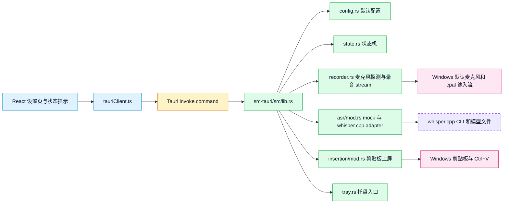
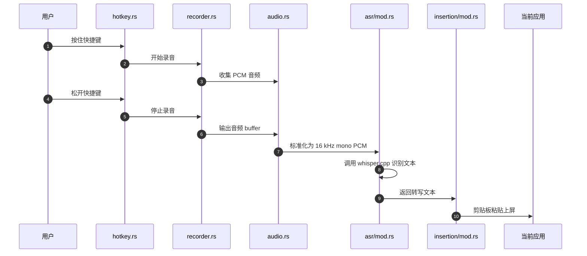
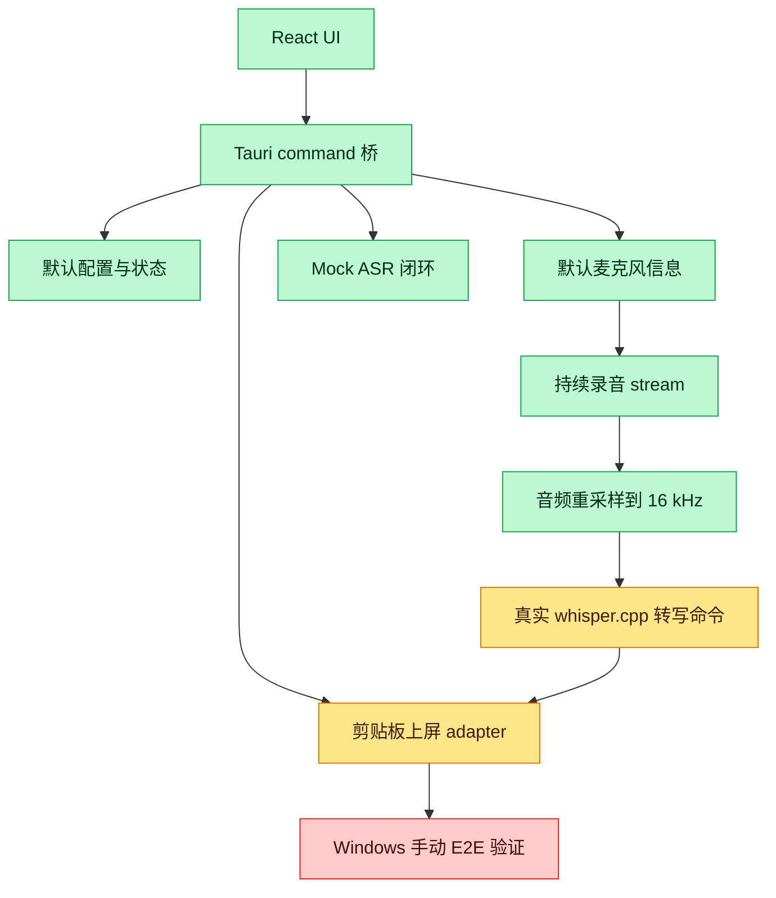

# VoxType 运行与代码理解指南

本文面向暂时不熟悉 Rust、Tauri 和语音输入法实现细节的维护者。目标是回答三个问题：

- 现在能不能看到效果。
- 每个运行命令是什么意思。
- 当前代码里的前端、Tauri、Rust、录音、ASR 和上屏模块分别负责什么。

## 当前能看到什么

现在可以看到一个“桌面应用骨架 + 最小真实语音输入闭环 + V2 日常输入界面”的效果。它还不是完整输入法，但已经能验证真实录音、whisper.cpp 转写、剪贴板上屏链路，以及全局按住说话的基础事件流。

可以验证的能力：

- 打开 VoxType 桌面窗口。
- 看到设置页和状态提示。
- 在 Tauri 桌面环境中读取默认麦克风信息。
- 读取输入设备列表，并在界面中选择具体输入设备。
- 点击“开始录音采集”和“停止录音采集”，验证 `cpal` 能从默认麦克风采集音频样本。
- 导出最近一次录音的 `16 kHz` ASR WAV，方便直接播放确认录到的声音。
- 在配置 whisper.cpp 后，点击“转写最近录音”，验证真实 ASR 调用链路。
- 点击“转写并上屏最近录音”，验证真实转写后延迟切回目标输入框并上屏。
- 按住 `Ctrl+Alt+Space` 开始录音，松开后自动停止、转写并上屏。
- 按 `Ctrl+Alt+V` 开始录音，再按一次停止、转写并上屏。
- 在深色主界面中看到彩色流光语音波纹；录音态会显示动态频谱起伏。
- 点击“模拟一次语音输入闭环”，得到 mock 转写文本。
- 点击“测试剪贴板上屏”，尝试把文本粘贴到当前焦点位置。
- 看到托盘入口，并通过托盘菜单打开设置页或退出。
- 在“诊断日志”面板里看到每次操作的时间、结果和判断说明。

暂时还不能完全保证的能力：

- 全局快捷键在所有软件、所有输入法和所有权限边界下都稳定可用。
- 像正式输入法一样在所有软件中稳定上屏。
- TSF 输入法框架集成。

当前最准确的描述是：项目已经有可运行桌面壳、深色 V3 主界面、状态模型、彩色语音波纹、麦克风探测、输入设备列表、输入设备持久化、全局按住说话事件、全局切换录音事件、真实录音采集、16 kHz ASR 输入准备、whisper.cpp 一键安装/转写命令、诊断 WAV 导出和剪贴板上屏 adapter；后续重点是识别质量、模型选择、快捷键配置、真正实时流式 ASR 和更可靠的上屏策略。

## 第一次运行

建议在仓库根目录运行命令：

```bash
cd C:/grace_repos/open-source/vox-type
```

先做项目自检：

```bash
bash init.sh
```

这个命令检查 harness 文档、许可证、核心目录、JSON 状态文件是否齐全。它不是启动应用，只是确认仓库状态没有明显缺口。

安装前端依赖：

```bash
npm install
```

如果之前已经安装过，通常不需要重复执行，除非 `package.json` 或 `package-lock.json` 变了。

启动桌面应用开发模式：

```bash
npm run tauri -- dev
```

这个命令会启动 Vite 前端开发服务器，并打开 Tauri 桌面窗口。你想看“真实桌面效果”时优先用这个命令。

如果你只是想看网页 UI，不验证麦克风、托盘、剪贴板等系统能力，可以运行：

```bash
npm run dev
```

它只启动浏览器预览。浏览器模式下会显示“浏览器预览模式：系统能力需要在 Tauri 中验证”。这是正常现象。

如果看到下面这类报错：

```text
Error: Port 1420 is already in use
```

说明 Vite 开发服务器端口已经被占用，通常是你之前运行的 `npm run tauri -- dev` 或 `npm run dev` 还没停。处理方式是先关闭旧的终端窗口，或在旧终端里按 `Ctrl+C` 停掉服务，再重新运行。

如果看到下面这类提示：

```text
Failed to run dependency scan. Skipping dependency pre-bundling.
```

先看它后面有没有列出具体依赖名。本项目已经显式把 `@tauri-apps/api/core` 加入 Vite 预扫描配置；如果仍然出现但窗口能打开、按钮能用，它通常只是开发服务器预打包提示，不等于应用编译失败。真正需要处理的是后面明确写着某个依赖无法解析、窗口无法打开或前端白屏。

如果构建时看到下面这类错误：

```text
failed to remove file `src-tauri/target/debug/vox-type.exe`
Access is denied. (os error 5)
```

通常说明旧的 VoxType 调试程序还在运行，Rust 想覆盖 exe 但文件被占用。先关闭 VoxType 窗口和托盘进程，再重新运行构建命令。如果关不掉，需要在任务管理器里结束 `vox-type.exe`。

## 本机调试 exe 和跨机器安装包

如果已经运行过：

```bash
npm run tauri -- build --debug
```

那么会生成本机调试 exe：

```text
src-tauri/target/debug/vox-type.exe
```

这个 exe 适合在当前开发机器上快速双击验证，不建议直接复制到另一台机器使用。直接复制 debug exe 时，另一台机器可能没有配套的 WebView 资源或开发服务，窗口里会出现：

```text
Hmmm… can't reach this page
localhost refused to connect
ERR_CONNECTION_REFUSED
```

跨机器验证请使用 Tauri bundle 产物。当前 debug bundle 会生成：

```text
src-tauri/target/debug/bundle/nsis/VoxType_0.1.0_x64-setup.exe
src-tauri/target/debug/bundle/msi/VoxType_0.1.0_x64_en-US.msi
```

把 `VoxType_0.1.0_x64-setup.exe` 或 MSI 复制到另一台机器安装运行，而不是复制 `src-tauri/target/debug/vox-type.exe`。

## 命令速查

| 命令 | 作用 | 什么时候用 |
|---|---|---|
| `bash init.sh` | 检查项目 harness 和核心文件是否齐全 | 每次开始工作前 |
| `npm install` | 安装前端和 Tauri CLI 依赖 | 首次拉仓库或依赖变化后 |
| `npm run dev` | 启动浏览器版前端预览 | 只看 UI，不测系统能力 |
| `npm run tauri -- dev` | 启动 Tauri 桌面开发模式 | 看桌面应用、托盘、麦克风、剪贴板 |
| `npm run typecheck` | TypeScript 类型检查 | 改前端后 |
| `npm test -- --run` | 运行前端单元测试一次 | 改 UI 或前端逻辑后 |
| `npm run build` | 构建前端静态文件 | 提交前或打包前 |
| `cargo fmt --all --manifest-path src-tauri/Cargo.toml` | 格式化 Rust 代码 | 改 Rust 后 |
| `cargo check --manifest-path src-tauri/Cargo.toml` | 快速检查 Rust 是否能编译 | 改 Rust 后快速反馈 |
| `cargo test --manifest-path src-tauri/Cargo.toml` | 运行 Rust 单元测试 | 改 Rust 模块后 |
| `cargo clippy --manifest-path src-tauri/Cargo.toml --all-targets -- -D warnings` | Rust lint，警告当错误 | 提交前 |
| `npm run tauri -- build --debug` | 构建调试版桌面应用和安装包 | 本机验证或生成跨机器安装包时 |

这里的 `--manifest-path src-tauri/Cargo.toml` 是告诉 Cargo：Rust 项目的配置文件在 `src-tauri/Cargo.toml`，不是仓库根目录。

## 运行后怎么试

### 1. 桌面窗口

运行：

```bash
npm run tauri -- dev
```

窗口打开后，你应该看到：

- 默认主界面标题：`VoxType`。
- 深色径向背景和中间的语音状态面板。
- 彩色语音波纹：待命时轻微呼吸，录音时频谱柱会连续起伏。
- 主按钮：`开始录音`。再次点击会停止录音、转写，并给你 3 秒切回目标输入框后尝试上屏。
- 最近识别文本区域。
- 快速设置：输入设备、ASR 状态、模型和快捷键状态。如果快捷键显示 `Ctrl+Alt+Space`，说明 Tauri 已注册全局快捷键；如果显示 `需处理`，进入诊断模式看具体失败原因。
- 如果 ASR 未就绪，会看到 `一键安装 whisper.cpp`。
- 右上角有 `诊断模式` 按钮，可以进入原来的测试/诊断工作台。

点击 `诊断模式` 后，会看到：

- 标题：`诊断工作台`。
- `运行状态`、`ASR 配置`、`测试操作` 和 `诊断日志` 面板。`运行状态` 里有 `全局快捷键`，用于确认快捷键注册是否成功，以及失败原因。
- `刷新全局快捷键状态` 按钮，用于验证前后重新读取 Tauri 保存的快捷键注册状态。
- 测试桌面浮窗 / 隐藏桌面浮窗 按钮，用于单独验证屏幕底部的小型五彩语音浮窗是否能显示。
- 按钮：`开始录音采集`、`停止录音采集`、`刷新录音状态`、`导出最近录音 WAV`、`转写最近录音`、`转写并上屏最近录音`、`模拟一次语音输入闭环`、`测试剪贴板上屏`。
- `复制全部日志` 按钮，用于把当前诊断日志一次性复制出来。

判断运行成功：

- 窗口能打开。
- 主界面能看到 `VoxType` 和 `开始录音`。
- 进入 `诊断模式` 后，`诊断日志` 至少有一条“应用启动”。
- 主界面快捷键卡片显示 `Ctrl+Alt+Space / Ctrl+Alt+V`，或诊断模式 `全局快捷键` 显示注册成功。
- 按住 `Ctrl+Alt+Space` 时，主界面状态应进入录音；松开后会进入识别和上屏流程。
- 按一次 `Ctrl+Alt+V` 时，主界面状态应进入录音；再按一次会进入识别和上屏流程。
- 如果是 Tauri 桌面模式，诊断模式里会显示 `Tauri 运行中：可以验证系统能力`。
- 如果麦克风可用，诊断日志会出现“麦克风探测成功”。

判断运行失败：

- 终端出现 `error when starting dev server`，窗口没有打开。
- 窗口打开但完全白屏。
- 诊断日志出现红色左边框的失败项。

### 2. 录音采集

先看 `输入设备` 下拉框。如果里面有真实麦克风，优先选择真实麦克风；如果只看到 `Remote Audio`，说明当前系统默认输入可能是远程音频设备，识别结果可能只会返回 `(音)` 或空白。

点击：

```text
开始录音采集
```

然后对着麦克风说一小段话，再点击：

```text
停止录音采集
```

成功标志：

- 状态会显示录音已停止。
- 诊断日志出现“录音已启动”和“录音已停止”。
- “录音已停止”里 `sampleCount` 大于 0，`durationMs` 大于 0。

失败标志：

- 诊断日志出现“启动录音失败”或“停止录音失败”。
- `sampleCount` 一直是 0，说明没有采集到输入样本。常见原因是默认输入设备不是实际麦克风、系统权限阻止录音，或远程桌面音频设备没有输入数据。

注意：这一步证明 `cpal` 录到了音频样本，并且会准备一份 `16 kHz` ASR 输入摘要。它还不会自动转成文字，下一步才会把这份 ASR 输入接到 whisper.cpp。

如果 whisper.cpp 后续只返回 `(音)`，先点击：

```text
导出最近录音 WAV
```

诊断日志会显示一个 `last-asr-input.wav` 路径。播放这个文件：

- 如果听不到你的说话声，问题在输入设备或录音链路，先切换输入设备。
- 如果能清楚听到你的说话声，但转写仍然是 `(音)`，问题更可能在模型、语言参数、录音音量或 whisper.cpp 解码参数。

### 3. 真实 whisper.cpp 转写

真实转写依赖本机已有 whisper.cpp 可执行文件和模型文件。本项目不会把模型或 binary 提交到仓库。

推荐先在界面里配置，不要手动设置环境变量：

1. 启动桌面应用：`npm run tauri -- dev`。
2. 找到 `ASR 配置` 面板。
3. 点击 `一键安装 whisper.cpp`。
4. 等待诊断日志显示 `一键安装完成`。
5. 看面板是否显示 `已就绪`。

一键安装会下载：

- `whisper-bin-x64.zip`：来自 `ggml-org/whisper.cpp` GitHub Release。
- `ggml-base.bin`：来自 `ggerganov/whisper.cpp` Hugging Face 仓库，约 142 MiB。

安装位置是 Tauri 应用数据目录，不会写入仓库，也不会提交到 Git。

如果在另一台机器上只复制 `vox-type.exe` 运行，一键安装仍然可以尝试下载 whisper.cpp 和模型；这些文件会落到那台机器自己的 Tauri app data 目录。当前安装器已经设置下载超时：连接 20 秒内不通会失败，单个文件 300 秒内没完成也会失败。如果失败，优先看 `诊断日志` 里的错误；常见原因是目标机器无法访问 GitHub Release 或 Hugging Face。

如果你已经自己下载过 whisper.cpp，也可以手动填路径：

1. 在 `whisper.cpp 可执行文件` 填入 `whisper-cli.exe` 的完整路径。
2. 在 `Whisper 模型文件` 填入 `ggml-*.bin` 模型文件的完整路径。
3. `识别语言` 保持 `zh`。
4. 点击 `保存 ASR 配置`。
5. 看面板是否显示 `已就绪`。

这个配置会保存到 Tauri 的应用配置目录，不会写入仓库。

环境变量仍然保留为开发者兜底方案。如果你不想在界面里保存配置，可以先在同一个 PowerShell 窗口里设置：

```powershell
$env:VOXTYPE_WHISPER_CPP_BINARY="C:\path\to\whisper-cli.exe"
$env:VOXTYPE_WHISPER_CPP_MODEL="C:\path\to\ggml-model.bin"
$env:VOXTYPE_ASR_LANGUAGE="zh"
npm run tauri -- dev
```

变量含义：

| 环境变量 | 必需 | 含义 |
|---|---|---|
| `VOXTYPE_WHISPER_CPP_BINARY` | 是 | whisper.cpp CLI 可执行文件路径 |
| `VOXTYPE_WHISPER_CPP_MODEL` | 是 | whisper.cpp 模型文件路径 |
| `VOXTYPE_ASR_LANGUAGE` | 否 | 识别语言，默认 `zh` |

优先级：应用内保存的配置高于环境变量。也就是说，一旦你在界面里保存了路径，`转写最近录音` 会优先使用界面保存的路径。

### 4. 真实闭环上屏

推荐顺序：

1. 在 `输入设备` 里选择真实麦克风。
2. 在主界面点击 `开始录音`，或在诊断模式点击 `开始录音采集`。
3. 说一小段清楚的中文。
4. 主界面再次点击主按钮会走“停止、转写、等待上屏”闭环；诊断模式点击 `停止录音采集` 只停止录音，不自动转写。
5. 点击 `转写最近录音`，先确认文本是不是你说的话。
6. 如果文本正确，再点击 `转写并上屏最近录音`。
7. 看到日志提示“等待上屏”后，在 3 秒内切回 Notepad、VS Code 或浏览器输入框。

当前剪贴板上屏策略会把识别文本写入系统剪贴板并发送 `Ctrl+V`。为了避免目标软件读到旧剪贴板，MVP 暂时不自动恢复旧剪贴板。也就是说，上屏后系统剪贴板里会保留本次识别文本，这是当前为了可靠性做的取舍。

验证步骤：

1. 启动 Tauri 应用。
2. 点击 `开始录音采集`。
3. 说一小段中文。
4. 点击 `停止录音采集`。
5. 确认诊断日志显示已准备 16 kHz ASR 样本。
6. 点击 `转写最近录音`。

如果想验证完整语音输入闭环，点击 `转写并上屏最近录音` 后，等诊断日志提示“真实转写完成，等待上屏”，再在 3 秒内把光标切回 Notepad、VS Code 或浏览器输入框。这样可以避免点击 VoxType 按钮时焦点留在 VoxType 窗口。

成功标志：

- 诊断日志出现“真实转写成功”。
- 页面显示 whisper.cpp 返回的文本。
- 如果点击 `转写并上屏最近录音`，目标输入框应出现识别文本。
- 如果 whisper.cpp 返回 `(音)`，说明它没有识别出清晰语音。优先看“录音已停止”日志里的峰值音量和 RMS 音量：如果都很低，说明录音太小或没有录到麦克风；如果音量正常但仍返回 `(音)`，再检查默认输入设备是否是系统音频或远程音频设备。

失败标志：

- 如果 `ASR 配置` 面板显示 `缺少 whisper.cpp 可执行文件路径` 或 `缺少模型文件路径`，说明还没保存路径。
- 如果提示 binary 或模型文件不存在，说明路径不对。
- 如果提示 whisper.cpp 执行失败，需要看诊断日志里的 stderr 内容。
- 如果诊断日志出现 `[object Object]`，说明前端错误格式化又退化了，需要修 `src/errorFormat.ts`。

### 5. 全局按住说话

V2 已接入全局快捷键：

```text
Ctrl+Alt+Space
```

验证前先确认 ASR 配置已经 `已就绪`，并且输入设备已经选到可用麦克风。

推荐验证方式：

1. 启动桌面应用：`npm run tauri -- dev`。
2. 打开 Notepad、VS Code 或浏览器输入框，把光标放在目标输入框里。
3. 不要点击 VoxType 主按钮，直接按住 `Ctrl+Alt+Space`。
4. 说一小段中文。
5. 松开 `Ctrl+Alt+Space`。

成功标志：

- VoxType 主界面语音波纹进入录音态，彩色频谱柱会连续起伏。
- 松开快捷键后，状态依次进入识别、上屏、完成。
- 目标输入框出现识别文本。
- 诊断日志出现“快捷键录音已停止”和“快捷键闭环完成”。

失败标志：

- 按住快捷键后主界面没有进入录音态：可能是快捷键被其他软件占用，或全局快捷键注册失败。应用会继续启动，先用诊断模式里的按钮验证录音和转写，再查看启动终端是否有 `failed to register push-to-talk hotkey`。
- 主界面快捷键卡片显示 `需处理`，或诊断模式 `全局快捷键` 显示注册失败。
- 松开后没有文本：看诊断日志里是否是录音、ASR 配置、whisper.cpp 或剪贴板上屏失败。
- 文本没有进入目标输入框但剪贴板里有识别文本：说明上屏焦点仍然不稳，当前剪贴板策略还需要后续增强。

当前快捷键还不能在界面里修改。后续应把快捷键做成设置项，并检测冲突。

### 6. 模拟闭环

点击：

```text
模拟一次语音输入闭环
```

这会调用 Rust command `simulate_dictation`。当前它不会录音，而是走 mock：

```text
MockAsrEngine -> MockInsertion -> AppStatus::succeeded
```

所以它验证的是“前端按钮能调用 Rust，Rust 能返回状态，前端能更新 UI”。

成功标志：

- 状态从 `空闲` 变成 `已完成`。
- 页面出现 mock 文本。
- 诊断日志出现“模拟闭环成功”。

注意：这一步成功不代表真实录音成功，因为当前还没有把麦克风录音 stream 接入这条链路。

### 7. 麦克风信息

在 Tauri 桌面环境中，前端启动时会调用：

```text
get_default_input_info
```

Rust 使用 `cpal` 获取默认输入设备。如果机器有默认麦克风，设置区会显示设备名、采样率和声道数。如果失败，状态区域会显示读取失败信息。

成功标志：

- 设置区“麦克风”不再显示 `等待 Tauri 读取`。
- 诊断日志出现“麦克风探测成功”。

失败标志：

- 诊断日志出现“麦克风探测失败”。
- 常见原因是系统没有默认输入设备、麦克风被禁用，或系统权限阻止访问。

### 8. 剪贴板上屏测试

打开一个可输入文本的位置，例如 Notepad、VS Code 输入区或浏览器输入框，然后让光标保持在那里。

回到 VoxType 点击：

```text
测试剪贴板上屏
```

当前实现会做三件事：

1. 把测试文本写入剪贴板。
2. 读回剪贴板确认写入成功。
3. 模拟 `Ctrl+V`。

这是 MVP 第一阶段的上屏方案。它简单、可验证，但不是最终形态。为了避免目标软件读到旧剪贴板，当前版本暂时不恢复旧剪贴板；上屏后系统剪贴板会保留本次文本。后续如果要更稳，会再做延迟恢复、`SendInput(KEYEVENTF_UNICODE)`，更后面才考虑 TSF。

成功标志分两层：

- 程序层成功：诊断日志出现“剪贴板上屏请求已发送”。这说明 Rust 没有报错，已经尝试写剪贴板和发送 `Ctrl+V`。
- 用户可见成功：你刚才聚焦的 Notepad、VS Code 或浏览器输入框里真的出现了测试文字。

如果只有程序层成功，但输入框没有文字，通常说明点击 VoxType 按钮时焦点已经回到 VoxType 窗口，`Ctrl+V` 没发到目标软件。这个问题是剪贴板上屏方案的天然限制，后续需要通过更稳定的焦点管理或 `SendInput(KEYEVENTF_UNICODE)` 改进。

## 在哪里看日志和中间结果

当前有三类信息来源：

| 位置 | 能看到什么 | 适合判断什么 |
|---|---|---|
| VoxType 窗口的状态区 | 当前阶段、最后一次文本、录音摘要、运行时提示 | 用户可见结果 |
| VoxType 窗口的诊断日志 | 每次按钮点击、麦克风探测、录音采集、成功/失败原因 | 按钮到底有没有执行 |
| 启动命令所在终端 | Vite、Tauri、Rust 编译和运行错误 | 依赖、编译、启动问题 |

现在还没有文件日志。后续做真实 MVP 时，可以增加 `logs/voxtype.log` 这类本地日志文件，但要确保不记录用户语音内容和隐私文本。

## 总体架构



## 目标语音输入流程

最终想要的 MVP 流程大概是：



当前已经有其中一部分，但还没有把整条链路串起来。



## 代码目录怎么读

```text
vox-type/
  src/                    前端 React/TypeScript
  src-tauri/              Tauri + Rust 桌面壳
  docs/harness/           项目状态、证据、任务事实源
  docs/research/          需求、调研、技术方案
  openspec/changes/       已确认的规格变更
  TMP/research/           调研中间资料，不是正式产品代码
```

前端重点文件：

| 文件 | 作用 |
|---|---|
| `src/App.tsx` | 主界面，显示设置、状态、按钮 |
| `src/tauriClient.ts` | 封装所有前端调用 Rust 的 Tauri command |
| `src/types.ts` | 前端使用的数据结构类型 |
| `src/styles.css` | 当前 UI 样式 |
| `src/App.test.tsx` | 前端 smoke test |

Rust 重点文件：

| 文件 | 作用 |
|---|---|
| `src-tauri/src/lib.rs` | Tauri command 入口，把前端请求分发到 Rust 模块 |
| `src-tauri/src/config.rs` | 默认配置，例如 `zh-CN`、`whisper.cpp`、`clipboard` |
| `src-tauri/src/state.rs` | 应用状态机，例如 idle、recording、transcribing、succeeded |
| `src-tauri/src/error.rs` | 统一错误类型和前端可显示错误 |
| `src-tauri/src/recorder.rs` | 默认输入设备探测、录音 stream、录音 buffer、mono 标准化工具 |
| `src-tauri/src/asr/mod.rs` | ASR trait、mock ASR、whisper.cpp CLI adapter |
| `src-tauri/src/insertion/mod.rs` | 文本上屏 trait、mock insertion、Windows 剪贴板上屏 |
| `src-tauri/src/tray.rs` | 系统托盘入口 |
| `src-tauri/src/hotkey.rs` | 快捷键模块占位，后续接全局快捷键 |

## 前端和 Rust 怎么通信

前端不会直接调用 Rust 函数。它通过 Tauri 的 `invoke` 调用 command。


关键点：

- Rust 结构体通过 `serde` 转成 JSON。
- `#[serde(rename_all = "camelCase")]` 会把 Rust 字段名转成前端习惯的 camelCase。
- 例如 Rust 的 `last_transcript` 到前端会变成 `lastTranscript`。

## Rust 新手需要知道的几个概念

### `Cargo.toml`

`src-tauri/Cargo.toml` 类似 Rust 世界里的 `package.json`。它声明：

- 包名、版本、许可证。
- Rust edition。
- 依赖库，例如 `tauri`、`cpal`、`arboard`、`enigo`。
- 测试依赖，例如 `tempfile`。

## 依赖库解释

### Tauri

`Tauri` 是桌面应用外壳。可以把它理解成“用 Web 前端做界面，用 Rust 做系统能力”的框架。

在 VoxType 里它负责：

- 打开桌面窗口。
- 提供托盘能力。
- 让 React 通过 `invoke` 调用 Rust command。
- 打包成 Windows 可执行程序。

为什么不用纯网页：网页不能稳定访问全局快捷键、系统托盘、剪贴板粘贴、麦克风底层流和本地模型进程，这些更适合放到 Rust/Tauri 侧。

### `cpal`

`cpal` 是 Rust 音频输入输出库。

在 VoxType 里它负责：

- 查询默认麦克风。
- 读取默认输入配置，例如采样率和声道数。
- 后续实现持续录音 stream。

当前只接了“默认输入设备信息”，还没有真正开始录音。

### `arboard`

`arboard` 是跨平台剪贴板库。

在 VoxType 里它负责：

- 读取旧剪贴板文本。
- 写入要上屏的文本。
- 上屏后恢复旧剪贴板文本。

这就是“剪贴板粘贴并恢复”的第一版实现基础。

### `enigo`

`enigo` 是输入模拟库。

在 VoxType 里它负责：

- 模拟按下 `Ctrl`。
- 模拟点击 `V`。
- 释放 `Ctrl`。

也就是模拟用户按 `Ctrl+V`。它只能把按键发给当前焦点窗口，所以焦点在哪里非常关键。

### `@tauri-apps/api`

这是前端调用 Tauri 能力的 JavaScript/TypeScript API。

在 VoxType 里 `src/tauriClient.ts` 使用：

```ts
invoke<AppConfig>('get_config')
```

意思是前端请求 Rust 执行名为 `get_config` 的 command，并把结果当成 `AppConfig` 使用。

### Vite

`Vite` 是前端开发服务器和构建工具。

在 VoxType 里它负责：

- `npm run dev` 时启动浏览器预览。
- `npm run build` 时构建前端静态文件。
- `npm run tauri -- dev` 时给 Tauri 窗口提供前端页面。

### React

`React` 负责界面状态和渲染。当前主界面在 `src/App.tsx`。

### TypeScript

`TypeScript` 是带类型的 JavaScript。`src/types.ts` 里定义了前端期望的数据结构，例如 `AppConfig`、`AppStatus`、`RecorderInfo`。

### `Result<T, VoxError>`

很多 Rust 函数返回：

```rust
Result<T, VoxError>
```

意思是：

- 成功时返回 `T`。
- 失败时返回 `VoxError`。

这比直接抛异常更显式。Tauri command 返回错误时，前端可以拿到可序列化的错误信息。

### `trait`

`AsrEngine` 和 `InsertionStrategy` 是 trait。可以把 trait 理解成“接口”。

```rust
pub trait AsrEngine {
    fn transcribe(&self, pcm_16khz_mono: &[i16]) -> Result<Transcript, VoxError>;
}
```

这样做的好处是：

- 测试时用 `MockAsrEngine`。
- 真正识别时用 `WhisperCppEngine`。
- 后续如果接 `sherpa-onnx` 或云端 ASR，可以再加一个实现。

## 当前模块状态

| 模块 | 当前状态 | 下一步 |
|---|---|---|
| UI | 已有 macOS 风格主界面、诊断模式、状态、诊断日志和复制日志按钮 | 继续打磨视觉层级、空状态和日常使用入口 |
| Tauri command | 已有配置、状态、mock 闭环、麦克风信息、录音、转写、安装、导出 WAV、剪贴板上屏 | 增加全局快捷键 command 和更细的安装进度事件 |
| hotkey | 只有边界 | 接 Windows 全局快捷键，形成按住说话体验 |
| recorder | 可读取输入设备列表，可启动/停止 `cpal` 录音 stream，可输出样本数、时长、峰值和 RMS | 持久化设备选择，增加音量质量提示 |
| audio | 有 mono 标准化、16 kHz 线性重采样和诊断 WAV 导出 | 后续评估更高质量重采样、VAD 和降噪 |
| asr | 有 mock、whisper.cpp CLI adapter、应用内 ASR 配置保存/检测和最近录音真实转写 | 增加简体中文输出标准化、模型选择和识别参数配置 |
| asr_installer | 可一键下载 whisper.cpp Windows x64 CPU 版和 `ggml-base.bin`，校验文件并自动保存配置 | 加下载进度、取消按钮、国内镜像源和模型选择 |
| insertion | 有 mock、Windows 剪贴板 adapter 和真实转写后上屏 command，已手动验证真实闭环 | 评估延迟恢复剪贴板、Unicode `SendInput` 或更深层输入方案 |
| tray | 已有显示和退出 | 手动验证不同 Windows 环境下的托盘行为 |

## 下一步建议

第一版 MVP proof-of-life 已经完成：维护者已验证录音、whisper.cpp 转写、延迟切回目标输入框和剪贴板上屏链路；另一台机器也已验证安装包可以安装并运行到转写流程。

下一阶段建议先做“可用性增强”，优先级如下：

1. 文本标准化：默认输出简体中文，解决另一台机器返回繁体中文的问题。
2. 全局快捷键：从诊断按钮流程升级为按住说话、松开转写上屏。
3. 设备体验：持久化输入设备选择，并在录音质量差时给明确提示。
4. 模型体验：支持模型选择、下载进度、取消和镜像源。
5. 上屏可靠性：继续评估剪贴板恢复、Unicode `SendInput` 和更深层输入方案。

如果要复测第一版 MVP，仍然按“录音 -> 转写最近录音 -> 转写并上屏最近录音”的顺序验证；失败时点击 `复制全部日志`，把完整诊断日志用于定位。

### 如果按住 Ctrl+Alt+Space 没有任何反应

按下面顺序拆分问题：

1. 进入 `诊断模式`，点击 `测试桌面浮窗`。
2. 如果屏幕底部没有出现小型五彩波纹浮窗，先看诊断日志：`桌面浮窗显示失败` 表示 Tauri overlay 窗口或透明窗口配置有问题；`桌面浮窗显示请求已发送` 但看不见，则优先怀疑窗口层级、多屏位置或系统透明窗口限制。
3. 如果浮窗能显示，点击 `隐藏桌面浮窗`，再聚焦 VS Code、Notepad 或浏览器输入框，按住 `Ctrl+Alt+Space`。
4. 回到诊断模式看日志：如果没有 `收到全局快捷键按下`，说明系统没有把快捷键事件交给 VoxType，可能是组合键被其他软件、远程桌面或系统占用。
5. 如果有 `收到全局快捷键按下/松开`，但没有文字上屏，说明热键已进入应用，继续看录音、转写和剪贴板上屏日志。
