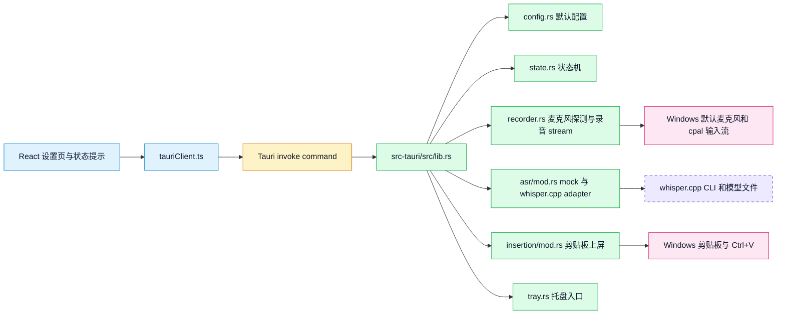
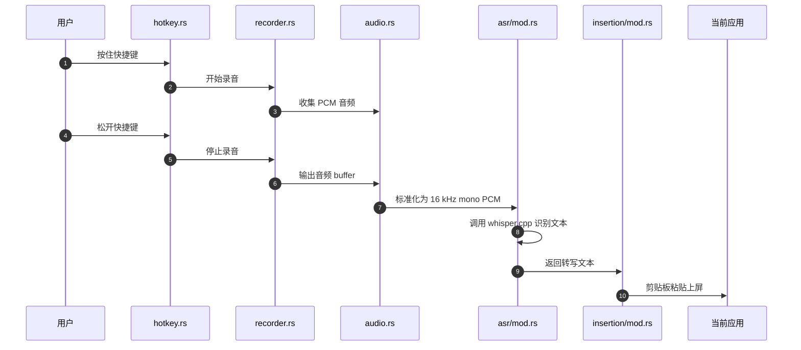
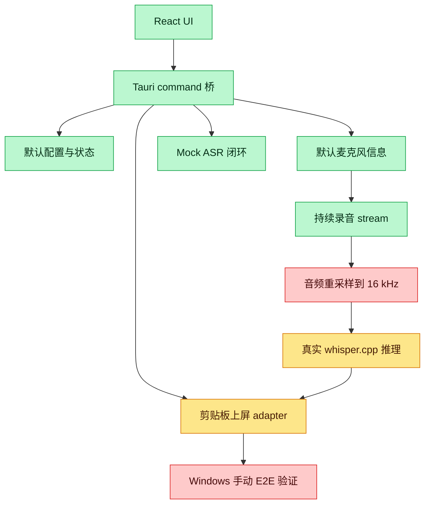

# VoxType 运行与代码理解指南

本文面向暂时不熟悉 Rust、Tauri 和语音输入法实现细节的维护者。目标是回答三个问题：

- 现在能不能看到效果。
- 每个运行命令是什么意思。
- 当前代码里的前端、Tauri、Rust、录音、ASR 和上屏模块分别负责什么。

## 当前能看到什么

现在可以看到一个“桌面应用骨架 + 部分系统能力 adapter”的效果。它还不是完整语音输入法。

可以验证的能力：

- 打开 VoxType 桌面窗口。
- 看到设置页和状态提示。
- 在 Tauri 桌面环境中读取默认麦克风信息。
- 点击“开始录音采集”和“停止录音采集”，验证 `cpal` 能从默认麦克风采集音频样本。
- 点击“模拟一次语音输入闭环”，得到 mock 转写文本。
- 点击“测试剪贴板上屏”，尝试把文本粘贴到当前焦点位置。
- 看到托盘入口，并通过托盘菜单打开设置页或退出。
- 在“诊断日志”面板里看到每次操作的时间、结果和判断说明。

暂时还不能验证的能力：

- 按住快捷键真实录音。
- 松开快捷键自动转写。
- 使用真实 whisper.cpp 模型识别你的语音。
- 像正式输入法一样在所有软件中稳定上屏。
- TSF 输入法框架集成。

当前最准确的描述是：项目已经有可运行桌面壳、UI、状态模型、麦克风探测、真实录音采集、剪贴板上屏 adapter 和 whisper.cpp adapter 边界，但“录音 -> whisper.cpp 转写 -> 上屏”的完整闭环还在实现中。

## 第一次运行

建议在仓库根目录运行命令：

```bash
cd C:/grace_repos/open-source/vox-type
```

先做项目自检：

```bash
bash init.sh
```

这个命令检查 harness 文档、许可证、核心目录、JSON 状态文件是否齐全。它不是启动应用，只是确认仓库状态没有明显缺口。

安装前端依赖：

```bash
npm install
```

如果之前已经安装过，通常不需要重复执行，除非 `package.json` 或 `package-lock.json` 变了。

启动桌面应用开发模式：

```bash
npm run tauri -- dev
```

这个命令会启动 Vite 前端开发服务器，并打开 Tauri 桌面窗口。你想看“真实桌面效果”时优先用这个命令。

如果你只是想看网页 UI，不验证麦克风、托盘、剪贴板等系统能力，可以运行：

```bash
npm run dev
```

它只启动浏览器预览。浏览器模式下会显示“浏览器预览模式：系统能力需要在 Tauri 中验证”。这是正常现象。

如果看到下面这类报错：

```text
Error: Port 1420 is already in use
```

说明 Vite 开发服务器端口已经被占用，通常是你之前运行的 `npm run tauri -- dev` 或 `npm run dev` 还没停。处理方式是先关闭旧的终端窗口，或在旧终端里按 `Ctrl+C` 停掉服务，再重新运行。

如果看到下面这类提示：

```text
Failed to run dependency scan. Skipping dependency pre-bundling.
```

先看它后面有没有列出具体依赖名。本项目已经显式把 `@tauri-apps/api/core` 加入 Vite 预扫描配置；如果仍然出现但窗口能打开、按钮能用，它通常只是开发服务器预打包提示，不等于应用编译失败。真正需要处理的是后面明确写着某个依赖无法解析、窗口无法打开或前端白屏。

如果构建时看到下面这类错误：

```text
failed to remove file `src-tauri/target/debug/vox-type.exe`
Access is denied. (os error 5)
```

通常说明旧的 VoxType 调试程序还在运行，Rust 想覆盖 exe 但文件被占用。先关闭 VoxType 窗口和托盘进程，再重新运行构建命令。如果关不掉，需要在任务管理器里结束 `vox-type.exe`。

## 直接运行已构建的 exe

如果已经运行过：

```bash
npm run tauri -- build --debug
```

那么会生成调试版 exe：

```text
src-tauri/target/debug/vox-type.exe
```

可以双击或在终端运行它。这个 exe 是本地构建产物，不提交到 Git。

## 命令速查

| 命令 | 作用 | 什么时候用 |
|---|---|---|
| `bash init.sh` | 检查项目 harness 和核心文件是否齐全 | 每次开始工作前 |
| `npm install` | 安装前端和 Tauri CLI 依赖 | 首次拉仓库或依赖变化后 |
| `npm run dev` | 启动浏览器版前端预览 | 只看 UI，不测系统能力 |
| `npm run tauri -- dev` | 启动 Tauri 桌面开发模式 | 看桌面应用、托盘、麦克风、剪贴板 |
| `npm run typecheck` | TypeScript 类型检查 | 改前端后 |
| `npm test -- --run` | 运行前端单元测试一次 | 改 UI 或前端逻辑后 |
| `npm run build` | 构建前端静态文件 | 提交前或打包前 |
| `cargo fmt --all --manifest-path src-tauri/Cargo.toml` | 格式化 Rust 代码 | 改 Rust 后 |
| `cargo check --manifest-path src-tauri/Cargo.toml` | 快速检查 Rust 是否能编译 | 改 Rust 后快速反馈 |
| `cargo test --manifest-path src-tauri/Cargo.toml` | 运行 Rust 单元测试 | 改 Rust 模块后 |
| `cargo clippy --manifest-path src-tauri/Cargo.toml --all-targets -- -D warnings` | Rust lint，警告当错误 | 提交前 |
| `npm run tauri -- build --debug` | 构建调试版桌面应用 | 想生成 exe 时 |

这里的 `--manifest-path src-tauri/Cargo.toml` 是告诉 Cargo：Rust 项目的配置文件在 `src-tauri/Cargo.toml`，不是仓库根目录。

## 运行后怎么试

### 1. 桌面窗口

运行：

```bash
npm run tauri -- dev
```

窗口打开后，你应该看到：

- 标题：`本地优先语音输入工具`
- 状态：`空闲`
- 设置：快捷键、目标语言、ASR 路线、上屏策略、界面形态、隐私默认、麦克风
- 按钮：`开始录音采集`、`停止录音采集`、`刷新录音状态`、`模拟一次语音输入闭环`、`测试剪贴板上屏`
- 一个 `诊断日志` 面板

判断运行成功：

- 窗口能打开。
- `诊断日志` 至少有一条“应用启动”。
- 如果是 Tauri 桌面模式，状态区域会显示 `Tauri 运行中：可以验证系统能力`。
- 如果麦克风可用，诊断日志会出现“麦克风探测成功”。

判断运行失败：

- 终端出现 `error when starting dev server`，窗口没有打开。
- 窗口打开但完全白屏。
- 诊断日志出现红色左边框的失败项。

### 2. 录音采集

点击：

```text
开始录音采集
```

然后对着麦克风说一小段话，再点击：

```text
停止录音采集
```

成功标志：

- 状态会显示录音已停止。
- 诊断日志出现“录音已启动”和“录音已停止”。
- “录音已停止”里 `sampleCount` 大于 0，`durationMs` 大于 0。

失败标志：

- 诊断日志出现“启动录音失败”或“停止录音失败”。
- `sampleCount` 一直是 0，说明没有采集到输入样本。常见原因是默认输入设备不是实际麦克风、系统权限阻止录音，或远程桌面音频设备没有输入数据。

注意：这一步证明 `cpal` 录到了音频样本，并且会准备一份 `16 kHz` ASR 输入摘要。它还不会自动转成文字，下一步才会把这份 ASR 输入接到 whisper.cpp。

### 3. 模拟闭环

点击：

```text
模拟一次语音输入闭环
```

这会调用 Rust command `simulate_dictation`。当前它不会录音，而是走 mock：

```text
MockAsrEngine -> MockInsertion -> AppStatus::succeeded
```

所以它验证的是“前端按钮能调用 Rust，Rust 能返回状态，前端能更新 UI”。

成功标志：

- 状态从 `空闲` 变成 `已完成`。
- 页面出现 mock 文本。
- 诊断日志出现“模拟闭环成功”。

注意：这一步成功不代表真实录音成功，因为当前还没有把麦克风录音 stream 接入这条链路。

### 4. 麦克风信息

在 Tauri 桌面环境中，前端启动时会调用：

```text
get_default_input_info
```

Rust 使用 `cpal` 获取默认输入设备。如果机器有默认麦克风，设置区会显示设备名、采样率和声道数。如果失败，状态区域会显示读取失败信息。

成功标志：

- 设置区“麦克风”不再显示 `等待 Tauri 读取`。
- 诊断日志出现“麦克风探测成功”。

失败标志：

- 诊断日志出现“麦克风探测失败”。
- 常见原因是系统没有默认输入设备、麦克风被禁用，或系统权限阻止访问。

### 5. 剪贴板上屏测试

打开一个可输入文本的位置，例如 Notepad、VS Code 输入区或浏览器输入框，然后让光标保持在那里。

回到 VoxType 点击：

```text
测试剪贴板上屏
```

当前实现会做三件事：

1. 保存旧剪贴板文本。
2. 把测试文本写入剪贴板。
3. 模拟 `Ctrl+V`，然后恢复旧剪贴板文本。

这是 MVP 第一阶段的上屏方案。它简单、可验证，但不是最终形态。后续如果要更稳，会再做 `SendInput(KEYEVENTF_UNICODE)`，更后面才考虑 TSF。

成功标志分两层：

- 程序层成功：诊断日志出现“剪贴板上屏请求已发送”。这说明 Rust 没有报错，已经尝试写剪贴板和发送 `Ctrl+V`。
- 用户可见成功：你刚才聚焦的 Notepad、VS Code 或浏览器输入框里真的出现了测试文字。

如果只有程序层成功，但输入框没有文字，通常说明点击 VoxType 按钮时焦点已经回到 VoxType 窗口，`Ctrl+V` 没发到目标软件。这个问题是剪贴板上屏方案的天然限制，后续需要通过更稳定的焦点管理或 `SendInput(KEYEVENTF_UNICODE)` 改进。

## 在哪里看日志和中间结果

当前有三类信息来源：

| 位置 | 能看到什么 | 适合判断什么 |
|---|---|---|
| VoxType 窗口的状态区 | 当前阶段、最后一次文本、录音摘要、运行时提示 | 用户可见结果 |
| VoxType 窗口的诊断日志 | 每次按钮点击、麦克风探测、录音采集、成功/失败原因 | 按钮到底有没有执行 |
| 启动命令所在终端 | Vite、Tauri、Rust 编译和运行错误 | 依赖、编译、启动问题 |

现在还没有文件日志。后续做真实 MVP 时，可以增加 `logs/voxtype.log` 这类本地日志文件，但要确保不记录用户语音内容和隐私文本。

## 总体架构



## 目标语音输入流程

最终想要的 MVP 流程大概是：



当前已经有其中一部分，但还没有把整条链路串起来。



## 代码目录怎么读

```text
vox-type/
  src/                    前端 React/TypeScript
  src-tauri/              Tauri + Rust 桌面壳
  docs/harness/           项目状态、证据、任务事实源
  docs/research/          需求、调研、技术方案
  openspec/changes/       已确认的规格变更
  TMP/research/           调研中间资料，不是正式产品代码
```

前端重点文件：

| 文件 | 作用 |
|---|---|
| `src/App.tsx` | 主界面，显示设置、状态、按钮 |
| `src/tauriClient.ts` | 封装所有前端调用 Rust 的 Tauri command |
| `src/types.ts` | 前端使用的数据结构类型 |
| `src/styles.css` | 当前 UI 样式 |
| `src/App.test.tsx` | 前端 smoke test |

Rust 重点文件：

| 文件 | 作用 |
|---|---|
| `src-tauri/src/lib.rs` | Tauri command 入口，把前端请求分发到 Rust 模块 |
| `src-tauri/src/config.rs` | 默认配置，例如 `zh-CN`、`whisper.cpp`、`clipboard` |
| `src-tauri/src/state.rs` | 应用状态机，例如 idle、recording、transcribing、succeeded |
| `src-tauri/src/error.rs` | 统一错误类型和前端可显示错误 |
| `src-tauri/src/recorder.rs` | 默认输入设备探测、录音 stream、录音 buffer、mono 标准化工具 |
| `src-tauri/src/asr/mod.rs` | ASR trait、mock ASR、whisper.cpp CLI adapter |
| `src-tauri/src/insertion/mod.rs` | 文本上屏 trait、mock insertion、Windows 剪贴板上屏 |
| `src-tauri/src/tray.rs` | 系统托盘入口 |
| `src-tauri/src/hotkey.rs` | 快捷键模块占位，后续接全局快捷键 |

## 前端和 Rust 怎么通信

前端不会直接调用 Rust 函数。它通过 Tauri 的 `invoke` 调用 command。


关键点：

- Rust 结构体通过 `serde` 转成 JSON。
- `#[serde(rename_all = "camelCase")]` 会把 Rust 字段名转成前端习惯的 camelCase。
- 例如 Rust 的 `last_transcript` 到前端会变成 `lastTranscript`。

## Rust 新手需要知道的几个概念

### `Cargo.toml`

`src-tauri/Cargo.toml` 类似 Rust 世界里的 `package.json`。它声明：

- 包名、版本、许可证。
- Rust edition。
- 依赖库，例如 `tauri`、`cpal`、`arboard`、`enigo`。
- 测试依赖，例如 `tempfile`。

## 依赖库解释

### Tauri

`Tauri` 是桌面应用外壳。可以把它理解成“用 Web 前端做界面，用 Rust 做系统能力”的框架。

在 VoxType 里它负责：

- 打开桌面窗口。
- 提供托盘能力。
- 让 React 通过 `invoke` 调用 Rust command。
- 打包成 Windows 可执行程序。

为什么不用纯网页：网页不能稳定访问全局快捷键、系统托盘、剪贴板粘贴、麦克风底层流和本地模型进程，这些更适合放到 Rust/Tauri 侧。

### `cpal`

`cpal` 是 Rust 音频输入输出库。

在 VoxType 里它负责：

- 查询默认麦克风。
- 读取默认输入配置，例如采样率和声道数。
- 后续实现持续录音 stream。

当前只接了“默认输入设备信息”，还没有真正开始录音。

### `arboard`

`arboard` 是跨平台剪贴板库。

在 VoxType 里它负责：

- 读取旧剪贴板文本。
- 写入要上屏的文本。
- 上屏后恢复旧剪贴板文本。

这就是“剪贴板粘贴并恢复”的第一版实现基础。

### `enigo`

`enigo` 是输入模拟库。

在 VoxType 里它负责：

- 模拟按下 `Ctrl`。
- 模拟点击 `V`。
- 释放 `Ctrl`。

也就是模拟用户按 `Ctrl+V`。它只能把按键发给当前焦点窗口，所以焦点在哪里非常关键。

### `@tauri-apps/api`

这是前端调用 Tauri 能力的 JavaScript/TypeScript API。

在 VoxType 里 `src/tauriClient.ts` 使用：

```ts
invoke<AppConfig>('get_config')
```

意思是前端请求 Rust 执行名为 `get_config` 的 command，并把结果当成 `AppConfig` 使用。

### Vite

`Vite` 是前端开发服务器和构建工具。

在 VoxType 里它负责：

- `npm run dev` 时启动浏览器预览。
- `npm run build` 时构建前端静态文件。
- `npm run tauri -- dev` 时给 Tauri 窗口提供前端页面。

### React

`React` 负责界面状态和渲染。当前主界面在 `src/App.tsx`。

### TypeScript

`TypeScript` 是带类型的 JavaScript。`src/types.ts` 里定义了前端期望的数据结构，例如 `AppConfig`、`AppStatus`、`RecorderInfo`。

### `Result<T, VoxError>`

很多 Rust 函数返回：

```rust
Result<T, VoxError>
```

意思是：

- 成功时返回 `T`。
- 失败时返回 `VoxError`。

这比直接抛异常更显式。Tauri command 返回错误时，前端可以拿到可序列化的错误信息。

### `trait`

`AsrEngine` 和 `InsertionStrategy` 是 trait。可以把 trait 理解成“接口”。

```rust
pub trait AsrEngine {
    fn transcribe(&self, pcm_16khz_mono: &[i16]) -> Result<Transcript, VoxError>;
}
```

这样做的好处是：

- 测试时用 `MockAsrEngine`。
- 真正识别时用 `WhisperCppEngine`。
- 后续如果接 `sherpa-onnx` 或云端 ASR，可以再加一个实现。

## 当前模块状态

| 模块 | 当前状态 | 下一步 |
|---|---|---|
| UI | 已有设置页、状态、按钮 | 增加真实录音状态反馈 |
| Tauri command | 已有配置、状态、mock 闭环、麦克风信息、剪贴板上屏 | 增加 start/stop dictation command |
| hotkey | 只有边界 | 接 Windows 全局快捷键 |
| recorder | 可读取默认设备，可启动/停止 `cpal` 录音 stream，可输出样本数和时长 | 把录音结果接到 ASR |
| audio | 有基础时长、mono 标准化工具和 16 kHz 重采样工具 | 后续评估更高质量重采样算法 |
| asr | 有 mock 和 whisper.cpp CLI adapter | 配置真实 binary/model，并跑真实音频 |
| insertion | 有 mock 和 Windows 剪贴板 adapter | 做 Notepad、VS Code、浏览器 E2E |
| tray | 已有显示和退出 | 手动验证托盘行为 |

## 下一步建议

先分两条线推进。

第一条线是“你自己试运行”：

1. 运行 `npm run tauri -- dev`。
2. 看窗口是否能打开。
3. 看麦克风信息是否显示。
4. 点击“开始录音采集”，说一小段话，再点击“停止录音采集”。
5. 确认诊断日志里的样本数和时长大于 0。
6. 试托盘菜单。
7. 在 Notepad 或 VS Code 中试“测试剪贴板上屏”。
8. 把失败现象记录到 `docs/harness/progress.md` 或发给 agent。

第二条线是“继续实现 MVP”：

1. 配置 whisper.cpp binary 和 model 路径。
2. 把停止录音得到的 16 kHz ASR 样本交给 `WhisperCppEngine`。
3. 做一条真实音频到文本再上屏的 proof-of-life。
4. 对 Notepad、VS Code、浏览器输入框做 Windows 手动 E2E。

建议先运行看效果，因为现在已经能验证桌面壳、托盘、麦克风探测和剪贴板上屏 adapter。运行结果会直接决定下一步优先修什么。
