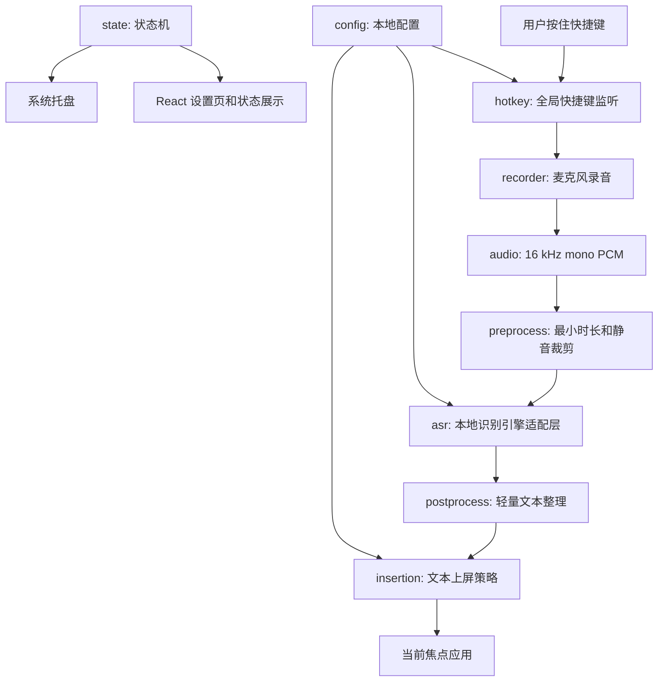

# VoxType MVP 技术方案草案

更新时间：2026-05-26

状态：已由维护者确认，已转入 `openspec/changes/voxtype-mvp-technical-direction/`。本文仍作为解释性研究文档；正式规格以 OpenSpec 为准。本文不是实现任务清单，不代表已经批准 scaffold 产品代码。

## 结论先行

推荐 VoxType MVP 使用 Rust + Tauri 2 + React/TypeScript。Rust 负责所有会影响可靠性的系统能力，React 只负责设置和状态展示。第一版目标不是“完整输入法”，而是跑通一个稳定闭环：按住快捷键录音，松开后本地转写，把文本输入到当前光标位置。

不建议第一版直接做 TSF IME。TSF 是后续提高可靠性的方向，不应该成为验证产品价值的前置门槛。

## 目标体验

用户正在任意应用中输入文字。用户按住全局快捷键，说话，松开快捷键。VoxType 在后台完成本地转写，并把文字输入到原来的光标位置。整个过程不要求用户打开 VoxType 主窗口，也不要求用户手动复制粘贴。

第一版成功标准：

- 用户可以完成一次“按住、说话、松开、上屏”。
- 音频默认不离开本机。
- 上屏失败、模型缺失、麦克风不可用、快捷键注册失败时有明确反馈。
- 项目有可运行的开发命令、基础测试和文档。

## 非目标

- 不做会议录音、会议总结、说话人分离。
- 不做 AI agent、知识库、自动改写工作流。
- 不做云端识别作为默认路径。
- 不做完整 TSF IME 作为第一版。
- 不做 macOS/Linux 同步上线。
- 不复制 GPL/AGPL 调研项目源码。

## 架构总览



核心原则：

- Rust 是可信核心。所有和系统资源、隐私、可靠性相关的逻辑都放 Rust。
- React 是控制面。设置、状态、错误说明由 React 展示，不承载关键路径。
- ASR 引擎通过 adapter 隔离。不要把 `whisper-cli`、whisper.cpp 或 sherpa-onnx 写死到业务流程里。
- 上屏策略分层。先剪贴板，再 `SendInput`，最后 TSF。这里的“分层”不是同时做三套，而是按阶段逐步提高可靠性：第一版先用最容易验证的方案跑通闭环，后续再替换或补强底层实现。

## 上屏策略解释

“上屏”就是把识别出来的文字输入到用户当前光标所在的位置。它是语音输入法最容易出问题的部分，所以建议分阶段做。

第一阶段是剪贴板粘贴。VoxType 把识别结果临时放进剪贴板，模拟 `Ctrl+V`，再尽量恢复用户原来的剪贴板内容。这个方案实现最快，适合第一版验证产品闭环。缺点是依赖剪贴板，极少数情况下可能恢复失败，也可能被目标应用拦截粘贴。

第二阶段是 Windows `SendInput(KEYEVENTF_UNICODE)`。`SendInput` 是 Windows 提供的模拟键盘输入 API，`KEYEVENTF_UNICODE` 可以直接发送 Unicode 字符。它不依赖剪贴板，比第一阶段更干净，但不同应用、权限边界和输入法状态下仍需要大量测试。

第三阶段是 TSF。TSF 全称 Text Services Framework，是 Windows 的文本服务框架，也是很多输入法和高级文本输入能力会接触的系统机制。它更接近“真正输入法”的集成方式，理论上能更好地处理光标、组合文本和 IME-aware 应用，但开发、调试、安装和测试成本都明显更高。因此 TSF 不作为 MVP，等前两阶段证明产品价值后再评估。

## 建议项目结构

```text
vox-type/
├── src/                         # React/TypeScript 前端
│   ├── app/
│   ├── components/
│   └── lib/
├── src-tauri/
│   ├── src/
│   │   ├── main.rs
│   │   ├── state.rs             # 应用状态机和事件
│   │   ├── config.rs            # 本地配置读写
│   │   ├── hotkey.rs            # 全局快捷键
│   │   ├── recorder.rs          # cpal 录音
│   │   ├── audio.rs             # 音频格式转换和裁剪
│   │   ├── asr/
│   │   │   ├── mod.rs           # Engine trait 和统一接口
│   │   │   ├── whisper.rs       # whisper.cpp/transcribe-rs 候选实现
│   │   │   └── sherpa.rs        # sherpa-onnx 候选实现
│   │   ├── insertion/
│   │   │   ├── mod.rs           # 上屏策略接口
│   │   │   ├── clipboard.rs     # 剪贴板粘贴并恢复
│   │   │   ├── send_input.rs    # Windows SendInput Unicode
│   │   │   └── tsf.rs           # 后续占位，不在 MVP 实现
│   │   └── error.rs             # 错误类型
│   └── tauri.conf.json
├── docs/
├── openspec/
└── TMP/
```

这只是建议结构。真正 scaffold 前还要根据 Tauri 2 模板调整文件名。

## 模块职责

### `hotkey`

负责注册、监听和注销全局快捷键。MVP 只需要一个 push-to-talk 快捷键。

关键要求：

- 支持按下和松开两个事件。
- 防止系统按键重复导致重复开始/停止。
- 快捷键注册失败时向 UI 报错。
- 后续允许用户修改快捷键。

### `recorder`

负责麦克风录音。建议使用 Rust `cpal`。

关键要求：

- 按下快捷键后开始采集。
- 松开快捷键后停止采集并返回音频 buffer。
- 内部统一错误：无麦克风、权限失败、设备断开、采样率不支持。
- 第一版先录完整片段，不做复杂流式识别。

### `audio`

负责把录音结果统一成 ASR 可用格式。

MVP 建议格式：16 kHz、mono、PCM。

第一版处理：

- 最短录音时长过滤，避免误触。
- 简单静音裁剪，减少无效音频。
- 记录音频时长，用于错误提示和调试。

后续增强：

- Silero/ONNX VAD。
- 预录音 ring buffer，避免开头音节丢失。

### `asr`

负责本地语音识别。这里必须做 adapter，不要把具体引擎耦合到业务状态机。

建议接口语义：

- 输入：标准化后的音频、语言设置、模型配置。
- 输出：文本、置信度或元数据、耗时、引擎信息。
- 错误：模型缺失、模型加载失败、识别失败、超时、不支持语言。

候选引擎：

- whisper.cpp/transcribe-rs：生态成熟，适合做本地 Whisper 路线验证。
- sherpa-onnx：Apache-2.0，Windows 支持好，值得重点评估。
- `whisper-cli` 子进程：可作为 proof-of-life，不建议作为长期架构边界。

### `insertion`

负责把文本输入到当前应用。

分阶段策略：

1. MVP：剪贴板粘贴并恢复原剪贴板。
2. 第二阶段：Windows `SendInput(KEYEVENTF_UNICODE)`。
3. 第三阶段：TSF IME 深集成。

MVP 剪贴板方案要求：

- 写入识别结果前读取原剪贴板。
- 发送粘贴快捷键后尽量恢复原剪贴板。
- 插入过程串行化，避免并发破坏剪贴板。
- 如果恢复失败，要给用户可理解的提示。

为什么不第一版直接 TSF：TSF 能提高上屏质量，但它会显著增加实现、安装、调试和测试成本。产品第一阶段更需要验证用户是否接受“按住说话再上屏”的核心体验。

### `state`

负责应用状态机。不要让 UI 自己推断核心状态。

建议状态：

- `Idle`
- `Recording`
- `Transcribing`
- `Inserting`
- `Succeeded`
- `Failed`

关键要求：

- 状态变更通过 Tauri event 通知 React。
- 所有错误带上可展示 message 和内部 code。
- 长时间识别要有超时和取消策略。

### `config`

负责本地配置。

MVP 配置：

- 快捷键。
- ASR 引擎类型。
- 模型路径。
- 语言偏好。
- 上屏策略。
- 是否显示状态提示。

配置文件必须在用户本地目录，不能写死个人机器路径。

## UI 建议

第一版 UI 应保持工具属性，不做营销页。

建议包含：

- 托盘菜单：打开设置、启用/暂停、退出。
- 设置页：快捷键、麦克风、模型路径、语言、上屏策略。
- 状态提示：录音中、识别中、失败原因。

状态提示必须避免抢焦点。若无法保证，就先用托盘状态或系统通知，不做浮窗。

## 错误处理

MVP 必须覆盖这些错误：

- 快捷键注册失败。
- 麦克风不可用或权限失败。
- 录音太短。
- 模型文件不存在。
- ASR 引擎初始化失败。
- 转写超时。
- 上屏失败。
- 剪贴板恢复失败。

错误消息要区分用户可操作信息和内部调试信息。例如用户看到“没有找到模型文件，请在设置中选择模型”，日志里记录具体路径。

## 隐私和开源边界

- 默认不上传音频。
- 默认不保存录音。
- 如果后续保存历史，必须提供关闭选项和清理入口。
- 不提交模型文件、音频样本、密钥或本机路径。
- 第三方依赖进入代码前要记录许可证。
- GPL/AGPL 调研项目只做概念参考。

## 测试策略

第一阶段重点测模块边界，不强求真实麦克风和真实 Windows 全链路都自动化。

建议测试层次：

- Rust 单元测试：状态机、配置解析、错误映射、音频格式转换、文本后处理。
- Rust 集成测试：ASR adapter 的 mock、insertion strategy 的 mock。
- 前端测试：设置项渲染、状态展示、错误展示。
- 手动 E2E：Windows 上验证按住说话、松开转写、粘贴到 Notepad、VS Code、浏览器输入框。

验收命令在 scaffold 后再写入 README。当前阶段不要把 `cargo test` 或 `npm run tauri dev` 当作项目标准命令。

## 分阶段路线

### Phase 0：方案确认

- 维护者确认本文方案或提出修改。
- 将确认后的方案写入 OpenSpec。
- 拆分实现计划。

### Phase 1：可运行骨架

- 创建 Tauri 2 + React/TS + Rust 项目。
- 建立 lint、format、test 基线。
- 建立配置和状态机 skeleton。

### Phase 2：本地闭环 proof-of-life

- 实现快捷键开始/停止录音。
- 标准化音频。
- 接一个最小 ASR 后端。
- 把文本通过剪贴板粘贴到当前应用。

### Phase 3：可靠性增强

- 增加防抖。
- 增加录音 watchdog。
- 增加更明确的错误和状态反馈。
- 增加剪贴板恢复保护。

### Phase 4：引擎和上屏升级

- 对比 whisper.cpp/transcribe-rs 与 sherpa-onnx。
- 引入 `SendInput(KEYEVENTF_UNICODE)`。
- 评估 TSF 是否值得进入下一阶段。

## 已确认的关键决策

1. 第一版语言目标：中文优先，兼容英文。
2. 第一版上屏策略：接受剪贴板粘贴并恢复原剪贴板。
3. 第一版 ASR 路线：优先使用 whisper.cpp 路线，同时保留 ASR adapter，避免未来切换 sherpa-onnx 时重写业务流程。
4. 第一版 UI 形态：接受“托盘 + 设置页 + 状态提示”的工具形态。

这些决策来自维护者确认：“所有的都按建议来”。
