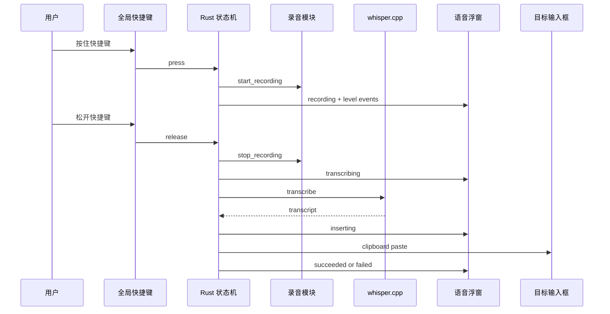

# VoxType V2 日常语音输入设计

更新时间：2026-05-27

状态：维护者已批准方向，进入第二版实现。本文是 V2 的产品、交互和技术设计，后续实施计划见 `docs/superpowers/plans/2026-05-27-v2-daily-dictation.md`。

## 目标

V1 已经证明本地录音、whisper.cpp 转写和剪贴板上屏可以跑通。V2 的目标是把 VoxType 从“诊断按钮工作台”推进到“日常可用的语音输入工具”：用户把光标放到任意输入框，按住全局快捷键说话，松开后本地转写并把文字送到当前光标位置。

V2 的产品重心不是增加复杂能力，而是降低日常使用摩擦。

## 用户体验

目标体验接近 Windows `Win + H` 语音输入：

1. 用户在 Notepad、VS Code、浏览器输入框或其他文本框里放好光标。
2. 用户按住 VoxType 快捷键。
3. 屏幕上出现一个小型语音浮窗，显示彩色流光波纹。
4. 用户说话时，波纹随音量起伏。
5. 用户松开快捷键。
6. 浮窗进入转写状态。
7. 转写完成后，VoxType 尝试把文字上屏到原目标输入框。
8. 成功后浮窗显示短暂反馈并自动淡出；失败时显示简短错误，并提供进入诊断模式的路径。

## V2 范围

### 必做

- 全局快捷键按住说话：按下开始录音，松开停止录音并触发转写上屏。
- 彩色流光语音浮窗：显示待命、录音中、转写中、成功、失败状态。
- 主界面重设计：去掉夸张的仿 macOS 窗口装饰，不再模拟红黄绿窗口按钮。
- 诊断模式保留：测试按钮、日志复制、ASR 配置仍然可用，但不作为默认体验。
- 简体中文优先：whisper.cpp 调用增加简体中文提示或后处理入口，解决跨机器返回繁体中文的问题。
- 输入设备选择持久化：记住维护者上次选择的麦克风。

### 暂不做

- 不做 TSF 输入法框架。
- 不做完整模型市场。
- 不做云端 ASR。
- 不做 AI 改写、总结、命令识别。
- 不复制 Siri、Wispr Flow 或其他产品的具体视觉素材，只实现同类交互概念。

## UI 方向

V2 的界面方向是“安静的系统工具 + 一个高质量语音状态浮窗”。

主界面应该克制：

- 中性浅色背景。
- 清楚的状态、快捷键、输入设备、ASR 就绪情况。
- 一个主操作按钮。
- 一个诊断模式入口。
- 不使用假系统标题栏、红黄绿按钮或过度装饰。

语音浮窗可以更有记忆点：

- 小尺寸、半透明、置顶。
- 中心是彩色流光波纹。
- 录音中波纹活跃，转写中变成水平流动光带。
- 成功时收束并显示识别文本片段。
- 失败时变成低饱和警告色。

## 彩色流光波纹设计

第一版实现使用 Canvas 2D 或等价轻量前端实现，不使用 WebGL/Three.js。视觉不需要追求复杂 3D，关键是状态表达准确、运动顺滑、颜色有层次。

状态映射：

| 状态 | 文案 | 视觉 |
|---|---|---|
| `idle` | 已就绪 | 慢速柔光短波纹 |
| `recording` | 正在听 | 彩色波形随音量起伏 |
| `transcribing` | 转写中 | 水平流光光带 |
| `inserting` | 上屏中 | 光带收束，表示即将输入 |
| `succeeded` | 已上屏 | 显示识别文本片段后淡出 |
| `failed` | 需要处理 | 波纹降为琥珀/红色，并提示进入诊断 |

## 技术设计

### 前端

新增组件：

- `src/VoiceOverlay.tsx`：语音浮窗组件，接收 phase、level、message、transcript。
- `src/voiceOverlayModel.ts`：把 `AppStatus`、录音状态和错误状态转换为浮窗展示模型。
- `src/VoiceOverlay.test.tsx`：覆盖状态文案、文本截断和辅助可访问标签。

主界面改造：

- `App.tsx` 保留业务流程，但把浮窗视觉拆到独立组件。
- 默认主界面改为普通工具窗口，不再使用 `traffic-lights`。
- 诊断模式继续保留。

### Rust/Tauri

后续任务新增：

- `hotkey.rs`：注册全局快捷键，处理按下和松开事件。
- `dictation.rs`：串联录音、转写、上屏，形成按住说话状态机。
- overlay window 管理：创建一个小型置顶窗口或在主窗口内先做浮窗预览。
- `text_normalization.rs`：简体中文优先策略入口。
- 配置扩展：保存快捷键、输入设备、输出文字偏好。

### 数据流

## 风险

- Tauri overlay window 在 Windows 上的置顶、透明、焦点行为需要手动验证。
- 剪贴板上屏仍可能受焦点、权限、目标应用策略影响。
- whisper.cpp 简体提示不一定完全稳定，可能需要 OpenCC 类后处理。
- 全局快捷键可能和用户已有快捷键冲突，需要可配置和失败提示。

## 验收标准

- 主界面不再像测试台，也不再像仿苹果窗口壳。
- 用户能看到彩色流光语音浮窗，并能区分待命、录音、转写、成功、失败状态。
- 诊断模式仍能进入，V1 的调试能力不丢失。
- 全局快捷键可完成一次按住说话闭环。
- 另一台机器默认输出应优先为简体中文；如果仍返回繁体，必须记录到 `docs/harness/debugging-log.md`。
- `npm test -- --run`、`npm run typecheck`、`cargo test --manifest-path src-tauri/Cargo.toml` 通过。