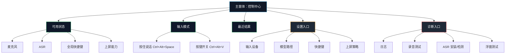

# VoxType V5 主窗体产品化重设计

## 背景

VoxType 的 MVP 已经验证了关键闭环：录音、whisper.cpp 本地转写、剪贴板上屏、两种全局快捷键模式和原生无外框浮窗。当前问题不再是“某个按钮怎么摆”，而是主窗体的产品职责没有收敛：测试按钮、系统状态、最近文本、快捷键说明和视觉动效混在一起，导致界面像调试台，不像给普通用户使用的产品。

V5 的目标是重新定义主窗体：它不是说话时的主要反馈界面，真正的即时反馈已经由底部原生浮窗承担；主窗体应该是一个低频打开的语音输入控制中心，用来确认系统是否可用、选择输入方式、处理配置问题和进入诊断。

## 设计原则

1. 日常用户优先：默认界面只展示“现在能不能用、怎么开始、当前模式是什么”。
2. 诊断能力保留：测试、日志、路径、WAV、ASR 安装和后端状态继续放在诊断模式，不堆到主界面。
3. 浮窗和主窗体分工明确：浮窗负责录音/转写时的即时状态，主窗体负责配置、状态和结果管理。
4. 视觉克制但不空洞：界面要有产品感，不能只有一个大按钮；信息要少，但每一块都有实际用途。
5. 开源可维护：主界面组件要拆小，避免继续把所有状态和 UI 写在一个巨大 `App.tsx` 里。

## 推荐方向

采用“控制中心 + 分层设置”的方案。

主窗体默认显示一个紧凑控制中心，结构为四块：

1. **顶部状态栏**：品牌、当前可用状态、诊断入口。
2. **输入模式区**：展示并切换两种模式：按住说话 `Ctrl+Alt+Space`、按键开关 `Ctrl+Alt+V`。
3. **准备状态区**：麦克风、ASR、快捷键、上屏四个能力用小型状态项展示，只显示是否正常，不展示冗长技术细节。
4. **最近结果区**：显示最近一次识别文本，提供复制、重新上屏、清空三个轻量动作。

不推荐继续把主界面做成“录音大舞台”。原因是用户真正说话时焦点在别的软件输入框，主窗体通常不会在前台；主窗体模拟浮窗动效只会增加视觉噪音，不能解决核心任务。

## 信息架构



## 主界面内容

### 顶部

- 左侧：`VoxType` 和一句短状态，例如“本地语音输入已就绪”。
- 右侧：诊断入口和设置入口。
- 不再使用仿 macOS 窗口红黄绿按钮，也不在主界面堆技术说明。

### 输入模式

用两个横向模式卡片或分段控件表达：

- **按住说话**：适合短句，按住 `Ctrl+Alt+Space`，松开后转写并上屏。
- **连续输入**：适合长句，按 `Ctrl+Alt+V` 开始，再按一次停止；录音中分段转写上屏。

每个模式只展示快捷键、用途和当前可用状态。主界面不需要复刻底部浮窗的完整动画，只保留一个小型状态符号即可。

### 准备状态

展示四个状态项：

- 麦克风：已连接 / 未找到 / 权限或设备异常。
- 本地识别：已就绪 / 需要安装 / 路径失效。
- 快捷键：已注册 / 注册失败。
- 上屏：剪贴板策略可用 / 需要诊断。

每个状态项最多一行，异常时给一个“去处理”入口，跳到设置或诊断的对应位置。

### 最近结果

保留最近一次识别文本，但默认只显示两到三行。动作限定为：

- 复制文本。
- 重新上屏。
- 清空。

不要把历史记录作为 V5 范围；历史、多条记录、搜索属于后续版本。

## 诊断模式边界

诊断模式继续保留以下内容：

- 详细日志、复制全部日志。
- 录音采集、停止采集、导出 WAV。
- ASR 安装、保存路径、检测路径。
- 浮窗后端、测试浮窗、隐藏浮窗。
- mock 闭环、真实转写、真实闭环。

诊断模式可以像工程工作台；主界面不能像工程工作台。

## 视觉方向

V5 主窗体应使用“深色精密控制台”方向，而不是仿苹果窗口壳。

- 背景：深黑到深灰的低对比渐变，不使用大面积紫色渐变和装饰光球。
- 字体：主标题 18-22 px，正文 13-14 px，标签 11-12 px；避免一个界面里字号跳变过大。
- 圆角：主容器 18-22 px，卡片 12-16 px，小状态 999 px 胶囊。
- 色彩：以中性深色为主体，状态色使用青绿、蓝、黄、红；彩色只用于状态和语音品牌符号。
- 动效：主窗体只做轻微状态过渡；复杂声波动效留给底部浮窗。

## 组件拆分建议

V5 实现时建议先拆组件，再重排 UI：

- `MainWindow.tsx`：主窗体页面结构。
- `ModeSelector.tsx`：两种输入模式展示和动作入口。
- `ReadinessPanel.tsx`：麦克风、ASR、快捷键、上屏状态。
- `RecentTranscript.tsx`：最近文本和操作。
- `DiagnosticView.tsx`：现有诊断模式迁移过去。
- `types.ts` 或 `viewModels.ts`：把状态映射从 JSX 中抽出来。

这样可以减少 `App.tsx` 继续膨胀，也让后续 UI 调整不影响录音和转写逻辑。

## V5 范围

包含：

- 重构主窗体信息架构。
- 保留两种快捷键模式。
- 保留现有原生浮窗效果，不在 V5 继续重做浮窗。
- 把主界面测试按钮下沉到诊断模式。
- 新增最近文本复制/重新上屏/清空的清晰入口。
- 更新中文文档和验证说明。

不包含：

- 新 ASR 引擎。
- 真正 token 级流式 ASR。
- TSF 输入法框架。
- 多条历史记录和全文搜索。
- 设置页完整重做。

## 验收标准

自动验证：

- `npm test -- --run`
- `npm run typecheck`
- `npm run build`
- `cargo check --manifest-path src-tauri/Cargo.toml --lib`
- `cargo clippy --manifest-path src-tauri/Cargo.toml --all-targets -- -D warnings`
- `cargo fmt --all --manifest-path src-tauri/Cargo.toml --check`
- `python -m json.tool docs/harness/feature_list.json`
- `git diff --check`

人工验证：

- 主界面一眼能看出当前是否可用。
- 主界面不再像测试工作台，不显示大量技术细节。
- `Ctrl+Alt+Space` 和 `Ctrl+Alt+V` 两种模式仍可用。
- 底部原生浮窗视觉不回退，不出现外层白灰框。
- 诊断模式仍能完成 ASR 安装、日志复制、录音测试和浮窗测试。

## 决策记录

| 日期 | 决策 | 原因 |
| --- | --- | --- |
| 2026-05-28 | V5 主窗体改为控制中心 | 当前界面问题来自职责混乱，不是单纯配色问题。 |
| 2026-05-28 | 浮窗保持现状 | 现有原生浮窗已解决最关键的白灰外框问题，V5 避免扩大范围。 |
| 2026-05-28 | 诊断模式继续保留工程能力 | 开源早期项目仍需要强诊断能力，但默认用户界面必须收敛。 |

## 2026-05-29 V5.1 设计修订

维护者确认 V5 方向后，进一步收敛为“识别记录为主体”的主界面。本修订覆盖 V5 实现后的下一轮 UI，不改变录音、ASR、原生浮窗或上屏核心链路。

### 主界面结构

```text
┌──────────────────────────────────────────────────────────────────────────────┐
│ VoxType                                                         [模型选择] [诊断] │
│ 语音输入控制中心                                                              │
├──────────────────────────────────────┬───────────────────────────────────────┤
│ 输入模式                              │ 准备状态                              │
│ ┌──────────────────────────────────┐ │ ┌──────────────┐ ┌──────────────┐   │
│ │ 按住说话                  ● Ready │ │ │ 🎙 麦克风     │ │ 🧠 本地识别   │   │
│ │ Ctrl+Alt+Space              [⚙]  │ │ │ Remote Audio │ │ whisper.cpp  │   │
│ └──────────────────────────────────┘ │ └──────────────┘ └──────────────┘   │
│ ┌──────────────────────────────────┐ │ ┌──────────────┐ ┌──────────────┐   │
│ │ 连续输入                  ● Ready │ │ │ ⌘ 上屏       │ │ ☁ 云端 API   │   │
│ │ Ctrl+Alt+V                  [⚙]  │ │ │ Clipboard    │ │ 未配置       │   │
│ └──────────────────────────────────┘ │ └──────────────┘ └──────────────┘   │
├──────────────────────────────────────┴───────────────────────────────────────┤
│                         [复用 VoiceOverlay 声波/六点动效的状态胶囊]          │
├──────────────────────────────────────────────────────────────────────────────┤
│ 识别记录                                      [清空全部] [导出文本]           │
│ 统计：[# 12] [⏱ 08:32] [文 1260] [⚡ 148/m]                                  │
│ ┌──────────────────────────────────────────────────────────────────────────┐ │
│ │ 14:32 最新识别文本                                                [复制][上屏][删除] │
│ └──────────────────────────────────────────────────────────────────────────┘ │
└──────────────────────────────────────────────────────────────────────────────┘
```

### 关键修订

- 顶部右侧不叫“设置”，改为“模型选择”。后续快捷键自定义可以从输入模式卡片里的小齿轮进入，本版先显示“下一版支持自定义快捷键”的 tooltip。
- 输入模式卡片直接显示各自快捷键的就绪状态：`Ctrl+Alt+Space` 和 `Ctrl+Alt+V` 都要可见。
- 准备状态卡保留少量可读文字，不只放图标；更详细解释放 `title` tooltip，减少界面长段说明。
- 准备状态不再重复“快捷键”，保留麦克风、本地识别、上屏、云端 API。
- 中间状态胶囊复用现有 `VoiceOverlay` 的声波和六点动效，让“就绪 / 录音中 / 转写中 / 完成”更像产品状态，而不是干文字。
- 识别记录改为主界面主体：本次运行期间保留，多条记录倒序显示，最新在上。
- 识别记录顶部放“清空全部”和“导出文本”，避免列表长时需要滚到底部。
- 每条记录右侧提供复制、重新上屏、删除。图标按钮必须有 `aria-label` 和 `title`。
- 统计数据来自本次运行：次数、累计录音时长、累计字数、平均字数/分钟；统计项用短标签或图标 + 数字，详细含义放 tooltip。
- 模型选择页本版先迁移 whisper.cpp 的一键安装、路径保存和检测；云端 API 只展示占位，不接真实能力。
- 诊断工作台继续保留排查工具，但配置职责逐步迁出到模型选择页。
