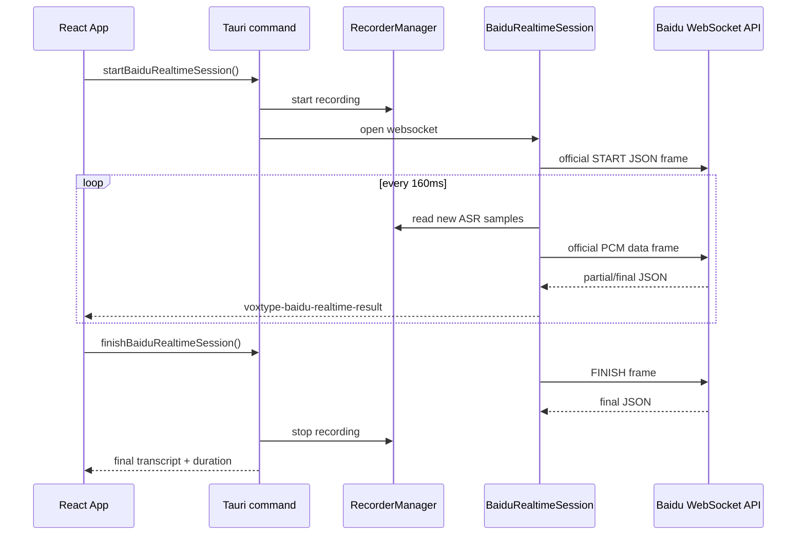

# V8 Baidu Realtime WebSocket API Design

## Context

V7 closed the model-routing work: push-to-talk and continuous input now have separate default models, Baidu Short Speech API remains the working cloud model, and Baidu Realtime WebSocket API is visible as a V8 placeholder. V8 should turn that placeholder into a real streaming ASR path, primarily for continuous input.

Official source provided by maintainer: https://cloud.baidu.com/doc/SPEECH/s/jlbxejt2i. The same doc id is also mirrored by Baidu AI Open Platform at https://ai.baidu.com/ai-doc/SPEECH/jlbxejt2i. V8 call shape must follow this official doc, not third-party examples.

## Product Goal

When the continuous input model is set to Baidu Realtime WebSocket API, VoxType should start a real Baidu WebSocket ASR session when continuous input starts, stream microphone audio while recording, receive partial/final text from Baidu, insert stable text into the target app, and close the session cleanly when continuous input stops.

Push-to-talk should continue to use stop-then-transcribe models by default. It can reject Baidu Realtime WebSocket API with a clear message unless a later version explicitly supports push-to-talk streaming.

## Protocol Facts From Official Docs

- WebSocket URI: `wss://vop.baidu.com/realtime_asr`.
- Auth/config is sent in a `START` frame, not through the short speech OAuth JSON body.
- Official START example uses a top-level `type: "START"` and a nested `data` object.
- Official START `data` fields include `appid`, `appkey`, `dev_pid`, optional `lm_id`, `cuid`, optional `user`, `format`, and `sample`.
- `appid` is the Baidu application AppID and should be stored as non-secret config.
- `appkey` is the Baidu application API Key and should be read from `BAIDU_ASR_API_KEY`.
- `format` is fixed to `pcm`.
- `sample` is fixed to `16000`.
- Recommended Mandarin model is `dev_pid: 15372` for stronger punctuation.
- PCM should be sent according to the official Sending Data Frame section. The official docs describe 160 ms audio chunks: `160 * (16000 * 2 / 1000) = 5120` bytes.
- End/control frames include `FINISH`, `CANCEL`, and `HEARTBEAT`.
- Server responses are JSON and must be parsed into partial/final recognition events.

## Architecture

Add a Rust-side realtime ASR module rather than driving WebSocket streaming from React. The microphone buffer and 16 kHz conversion already live in Rust; keeping the WebSocket client there avoids moving raw audio through the frontend event bridge.

The first implementation should be session-oriented:

1. Frontend calls `start_baidu_realtime_session` when continuous input starts and selected model is `baidu-realtime`.
2. Rust starts recording and starts a WebSocket worker tied to the current recording session.
3. The worker sends the official `START` JSON frame, then sends 16 kHz mono PCM data frames every 160 ms according to the official Sending Data Frame section.
4. The worker emits frontend events for partial/final transcript updates.
5. Frontend inserts only stable/final text by default, while showing partial text as status text.
6. On stop, frontend calls `finish_baidu_realtime_session`; Rust sends `FINISH`, drains final response, stops recording, and returns one session summary.
7. On failure/cancel, Rust sends `CANCEL` when possible, stops recording, and returns a structured error without leaking secrets.

## Data Flow



## API Surface

New Tauri commands:

- `start_baidu_realtime_session() -> BaiduRealtimeSessionStatus`
- `finish_baidu_realtime_session() -> BaiduRealtimeSessionSummary`
- `cancel_baidu_realtime_session() -> BaiduRealtimeSessionStatus`
- `get_baidu_realtime_session_status() -> BaiduRealtimeSessionStatus`

New frontend listener:

- `voxtype-baidu-realtime-result`

Event payload:

```typescript
interface BaiduRealtimeResultEvent {
  text: string;
  isFinal: boolean;
  sequence: number;
  startedAtMs: number;
  durationMs: number;
}
```

## Result Handling

Baidu response schema should be wrapped by a parser that accepts JSON strings and returns a narrow internal enum:

- `Started`
- `Partial { text, sequence }`
- `Final { text, sequence }`
- `Finished`
- `Error { code, message }`

Frontend behavior for V8:

- Partial text updates current status or floating overlay only.
- Final text is appended to the continuous input session buffer and inserted once.
- The transcript history still writes one merged record per continuous input session, not one record per partial frame.

## Security

- Use configured Baidu AppID as `appid` and `BAIDU_ASR_API_KEY` as `appkey`, matching the official START example.
- Do not send `BAIDU_ASR_SECRET_KEY` to the WebSocket API unless official docs require it in a later revision.
- Do not log API Key, Secret Key, access token, raw START frame, raw WebSocket URL if it ever includes credentials, or raw audio.
- Diagnostics may log provider name, endpoint host, dev_pid, sample rate, frame counts, and error codes.

## Error Handling

- Missing API Key: fail before opening WebSocket with a clear config error.
- Existing active realtime session: reject start with an explicit error.
- WebSocket open failure: stop recording and surface error.
- START failure response: cancel session, stop recording, surface Baidu error code/message.
- Send/read failure: cancel if possible, stop recording, keep already inserted final text, and record the failure in diagnostics.
- Stop timeout: send `FINISH`, wait for final result with bounded timeout, then close and return the best available text plus warning.

## Scope For V8

Included:

- Real Baidu realtime WebSocket API path for continuous input.
- Config/readiness reuse from V7 Baidu realtime fields.
- Rust WebSocket worker, protocol frames, parser tests, lifecycle tests.
- Frontend command/listener integration.
- One merged transcript record with model `baidu-realtime`.
- Docs and harness updates.

Excluded:

- LLM correction.
- VAD-driven segmentation.
- Realtime API support for push-to-talk.
- Multi-session concurrency.
- Changing the existing Baidu Short Speech API path.

## Verification

Automated:

- Parser unit tests for official START/partial/final/error response shapes.
- Frame builder tests for official START/FINISH/CANCEL/HEARTBEAT frames and 5120-byte PCM chunking.
- Session state tests for start, duplicate start, finish, cancel, and failure cleanup.
- React tests for choosing Baidu Realtime WebSocket API in continuous input and rendering/recording final metadata.
- Existing V7 tests continue passing.

Commands:

- `npm test -- --run src/App.test.tsx`
- `npm run typecheck`
- `npm run build`
- `cargo check --manifest-path src-tauri/Cargo.toml --lib`
- `cargo test --manifest-path src-tauri/Cargo.toml baidu_realtime --no-run`
- `cargo test --manifest-path src-tauri/Cargo.toml cloud_asr --no-run`
- `python -m json.tool docs/harness/feature_list.json`
- `git diff --check`

Manual:

- Set continuous input model to Baidu Realtime WebSocket API.
- Press continuous input hotkey once to start streaming.
- Speak for at least 10 seconds.
- Confirm partial/final status appears and final text is inserted.
- Press hotkey again to stop.
- Confirm one merged transcript history record includes continuous input, Baidu Realtime WebSocket API, duration, and character count.