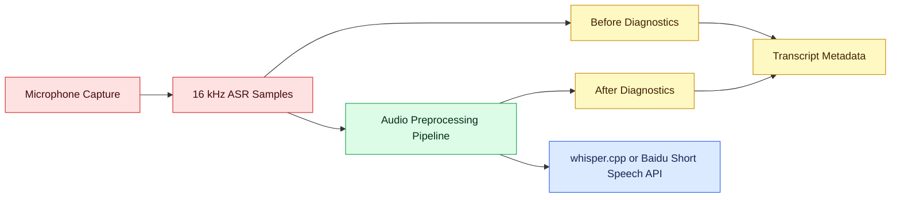

# V10 Audio Preprocessing Design

## Context

V9 makes poor recordings visible through lightweight audio quality diagnostics, but it intentionally does not change the waveform. V10 is the follow-up version for improving recognition quality when speech is quiet, distant, noisy, or silence-heavy.

This version touches the audio signal before ASR, so it has higher risk than transcript post-processing. Every transform must be explicit, testable, and easy to disable.

## Product Goals

Users can enable a conservative audio enhancement pipeline that improves ASR input quality for common desktop dictation problems:

- speech is too quiet because the user is far from the microphone,
- background noise hurts recognition,
- long silence or leading/trailing silence wastes ASR context,
- low-frequency rumble or fan noise affects the sample,
- volume varies across recordings.

The app should show whether preprocessing was applied and should keep enough diagnostics to compare original vs processed quality.

## Non-Goals

- Do not replace ASR providers in V10.
- Do not add LLM text correction; that belongs to the text-quality layer.
- Do not silently enable aggressive audio transforms for all users without a visible setting.
- Do not store raw user audio in transcript history.
- Do not require cloud preprocessing.
- Do not degrade Baidu Realtime WebSocket API streaming latency with heavyweight local processing unless explicitly enabled for that mode.

## Recommended Approach

Add a Rust audio preprocessing pipeline between recorded ASR samples and the existing ASR adapters. Start with deterministic DSP that is small enough to test locally:

1. DC offset removal.
2. Optional high-pass filter.
3. Conservative normalization or AGC.
4. Optional VAD-based leading/trailing silence trim.
5. Optional noise suppression after a library spike.

The default V10 path should be conservative:

- enabled by user setting, or enabled only after V9 diagnostics show a clear problem,
- process stop-then-transcribe recordings first,
- leave Baidu Realtime WebSocket API on raw PCM until a separate realtime-safe preprocessing path is validated.

## Data Flow

## Preprocessing Components

### DC Offset Removal

Subtract the mean sample value from the recording. This is low risk and should usually be enabled when preprocessing is enabled.

### High-Pass Filter

Apply a simple high-pass filter around 80 Hz to reduce rumble. This should be optional and covered by tests with low-frequency synthetic signals.

### Normalization / AGC

Start with peak/RMS normalization before a full dynamic AGC:

- target RMS around `0.08` to `0.12`,
- do not boost when peak headroom is too small,
- apply a max gain cap, for example `8x`,
- avoid clipping after gain.

A later AGC can use frame-level gain smoothing if simple normalization is not enough.

### VAD Trimming

Use the same frame-level energy features introduced by V9 as a first pass:

- trim leading/trailing silence,
- keep padding around detected speech,
- never drop the whole recording,
- do not split dictation into multiple records in V10 unless separately designed.

### Noise Suppression Spike

Evaluate whether to use a proven library instead of hand-rolling denoise:

- WebRTC noise suppression if Rust integration is practical and license-compatible.
- RNNoise if binary integration and license fit the project.
- A small spectral gate only if library integration is blocked and quality is acceptable.

The spike must document license, binary size, CPU cost, Windows compatibility, and before/after sample behavior.

## Settings And UX

V10 settings should live in one unified Settings surface instead of scattering related controls across top-level pages. The main window entry is 设置. Inside it, use five tabs:

- 输入: input device and hotkey settings.
- 模型: per-input-mode model routing plus provider/runtime credentials and paths.
- 音频增强: V10 audio preprocessing controls.
- 文本优化: V9 transcript post-processing controls.
- 诊断: runtime status, recorder tests, overlay tests, clipboard test, and diagnostic logs.

Audio enhancement is not a model provider setting. It applies to stop-then-transcribe ASR input before the selected provider receives audio, so it should be shown as its own settings tab.

The first audio enhancement UI should remain conservative:

- master toggle: 音频增强, disabled by default,
- default enabled transforms when the master switch is on: DC offset removal, normalization, and VAD trim,
- advanced transforms such as high-pass and denoise remain secondary/off until separately validated,
- no raw threshold sliders in the first UI unless tests show defaults are not robust.

Transcript history must make enhancement verifiable. When the enhancement pipeline is enabled and runs, the record should show compact metadata even if the input did not need a material trim or gain change. Acceptable labels include:

- 增强 / 裁剪 Nms
- 增强 / Nx
- 增强 / 无明显变化

This avoids a false negative where the user enables enhancement, records normally, and sees no evidence that the preprocessing path ran.

## Realtime WebSocket Consideration

Realtime preprocessing is more sensitive than stop-then-transcribe preprocessing. Baidu Realtime WebSocket API expects continuous 16 kHz PCM chunks with low latency. Heavy denoise, VAD segmentation, or large lookahead buffers can harm streaming behavior.

V10 should start with stop-then-transcribe paths:

- push-to-talk with local whisper.cpp,
- push-to-talk with Baidu Short Speech API,
- continuous input only if it still uses stop/final chunk processing.

Realtime WebSocket preprocessing should remain disabled until a small buffering design is tested. If added later, only low-latency transforms such as DC removal, simple high-pass, and conservative frame gain should be considered first.

## Privacy And Safety

- Store settings and numeric diagnostics only.
- Do not store raw recordings unless the user explicitly exports diagnostic WAV files.
- Diagnostic WAV export should go to the existing app-data diagnostics folder, not the repository.
- Never log user audio content or secret provider credentials.

## Verification

Automated checks:

- Rust tests for DC offset removal.
- Rust tests for high-pass behavior on synthetic low-frequency input.
- Rust tests for normalization gain cap and clipping prevention.
- Rust tests for VAD leading/trailing trim with padding and all-silence fallback.
- React tests for the audio enhancement settings UI.
- Existing V9 text quality/history tests continue passing.

Manual checks:

- Record a low-volume sample and compare before/after diagnostics.
- Verify recognition does not regress for a normal close-mic sample.
- Verify disabling audio enhancement restores raw-ASR behavior.
- Verify no raw audio is written unless diagnostic export is explicitly triggered.
