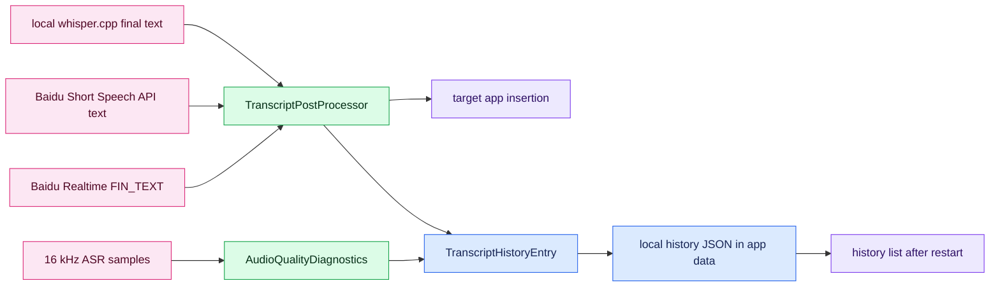

# V9 Transcript Quality, History Persistence, And Audio Diagnostics Design

## Context

V8 is closed. Baidu Realtime WebSocket API continuous input has been manually verified on the real desktop app, and the capsule overlay border clipping follow-up has been accepted. The next product gap is daily-use quality: speech recognition can mishear technical terms, transcript history currently behaves like session-local working memory, and poor microphone distance or low volume can quietly produce bad recognition.

V9 combines three related capabilities:

- Transcript quality: deterministic glossary, replacement, cleanup, and formatting rules.
- Transcript history persistence: recognized entries survive app restart and keep useful metadata.
- Lightweight audio quality diagnostics: detect likely low-volume, silence-heavy, clipped, or far-microphone recordings without changing captured audio.

These belong together because stored history should preserve the final text users actually inserted, plus enough metadata to diagnose which input mode, model, and audio conditions produced it.

## Product Goals

Users can configure local text optimization rules and keep recognition history across restarts.

Users also get actionable quality hints when a recording is likely too quiet, clipped, silence-heavy, or captured too far from the microphone. V9 should make bad input visible; it should not repair the waveform yet.

The app should store transcript entries with:

- final inserted text after post-processing,
- input mode: push-to-talk or continuous input,
- model: local whisper.cpp, Baidu Short Speech API, or Baidu Realtime WebSocket API,
- duration, character count, timestamp,
- optional processing metadata such as applied rule count,
- optional audio quality metadata such as RMS level, peak level, silence ratio, and warning labels.

The first implementation should be local-only, deterministic, and explainable. It should not require a cloud LLM or any account beyond the already configured ASR providers.

## Non-Goals

- Do not implement SendInput or TSF in V9.
- Do not insert Baidu MID_TEXT partial results into the target app.
- Do not add LLM rewriting as a required dependency.
- Do not store raw audio in transcript history.
- Do not implement AGC, denoise, VAD trimming, high-pass filtering, or waveform normalization in V9.
- Do not store API keys, access tokens, or secret environment values.
- Do not build cloud sync for transcript history.

## Recommended Approach

Use a Rust-owned durable storage layer for transcript history, a Rust-owned deterministic post-processing module for text quality, and a small Rust audio diagnostics helper that operates on already captured 16 kHz ASR samples. React remains the UI/control layer, but persistence, validation, text processing, and quality summary generation live in Tauri commands so behavior is consistent across all ASR paths.

A simple JSON file in the Tauri app data directory is enough for V9. Use bounded history retention to avoid unbounded file growth.

Default retention:

- keep latest 500 entries,
- provide clear-all action,
- no automatic cloud sync,
- future export can reuse the same stored model.

## Data Flow



## Transcript Quality Design

The post-processing module should support:

- enabled flag,
- replacement rules such as `scale => skill`,
- glossary terms with fixed spelling such as `WebSocket`, `whisper.cpp`, `VoxType`,
- noise cleanup for short caption artifacts,
- whitespace and punctuation normalization,
- preview command for the settings UI.

Processing order:

1. Normalize whitespace.
2. Drop known noise-only strings.
3. Apply enabled replacement rules, longest source text first.
4. Normalize glossary term spelling.
5. Trim final output.

The processor returns both processed text and a small metadata object, for example `rulesApplied: 2`. Diagnostics should not log full user text by default.

## Audio Quality Diagnostics Design

V9 should calculate quality hints from captured ASR samples after recording stops. This is diagnostic metadata only; samples passed to ASR remain unchanged.

Signals:

- RMS amplitude: warn when the whole recording is likely too quiet.
- Peak amplitude: warn when the signal is close to clipping.
- Silence ratio: warn when most frames are below a silence threshold.
- Active speech duration estimate: useful for recognizing mostly-empty recordings.
- Derived warning labels: `low_volume`, `clipping_risk`, `mostly_silence`, `possible_far_microphone`.

Recommended first thresholds:

- `low_volume`: RMS below `0.015`.
- `clipping_risk`: peak above `0.98`.
- `mostly_silence`: more than `70%` of 20 ms frames have RMS below `0.01`.
- `possible_far_microphone`: RMS below `0.03` and silence ratio above `45%`.

These thresholds should be constants covered by tests, not user-facing tuning controls in V9. The UI can show a compact warning pill in transcript metadata or diagnostics, for example `low volume` or `far mic?`, without blocking insertion.

V9 must not perform real denoise, gain control, voice activity trimming, or filtering. Those changes belong to V10 because they can change recognition behavior and need before/after validation.

## Transcript History Persistence Design

Create a history store that loads on app startup and writes whenever a new transcript entry is created.

Suggested type shape:

```typescript
interface PersistedTranscriptEntry {
  id: string;
  text: string;
  inputMode: 'push-to-talk' | 'toggle-dictation';
  model: 'local-whisper' | 'baidu-short' | 'baidu-realtime';
  createdAtMs: number;
  durationMs: number;
  characterCount: number;
  postprocessRulesApplied: number;
  audioQuality?: {
    rms: number;
    peak: number;
    silenceRatio: number;
    activeSpeechMs: number;
    warnings: Array<'low_volume' | 'clipping_risk' | 'mostly_silence' | 'possible_far_microphone'>;
  };
}
```

The store should provide commands:

- `load_transcript_history() -> Vec<PersistedTranscriptEntry>`
- `save_transcript_history_entry(entry) -> PersistedTranscriptEntry`
- `delete_transcript_history_entry(id) -> Vec<PersistedTranscriptEntry>`
- `clear_transcript_history() -> Vec<PersistedTranscriptEntry>`

React can still manage the visible list, but mutations should go through these commands so disk and UI stay aligned.

## UI Design

Keep the main history UI visually close to the current V7/V8 record cards. V9 should add persistence and compact diagnostics without making the main screen heavier.

Required user-visible changes:

- history loads after restart,
- clear-all clears persistent storage too,
- deleting one row deletes it from storage too,
- export uses persisted + current visible entries consistently,
- settings page adds a text optimization panel with preview,
- low-quality recordings can show a compact diagnostic hint on the history row and/or diagnostics page.

## Error Handling

- Corrupt history file: rename or ignore it, start with empty history, and show a diagnostic warning.
- Disk write failure: keep the UI entry but show a non-blocking warning that persistence failed.
- Post-processing config failure: fall back to disabled text optimization.
- Replacement rule creates empty text: keep original text and report a warning.
- Audio diagnostics failure: keep the transcript entry and omit audio quality metadata; do not block insertion or history persistence.

## Privacy

Transcript history contains user content. Keep it local in the Tauri app data directory. Do not put history entries in repository files, tests, logs, or diagnostics. Tests should use synthetic text only.

Audio quality diagnostics must store numeric summaries and warning labels only. Do not store raw audio with history entries.

## Verification

Automated checks:

- Rust no-run tests for post-processing and history storage.
- Rust no-run tests for audio diagnostics thresholds: low RMS, clipping risk, mostly silence, and possible far microphone.
- React tests for loading persisted history, saving new entries, deleting entries, and clearing all.
- React tests for `scale => skill` preview and runtime application.
- React tests for rendering an audio quality warning on a history row.
- Existing V8 realtime tests continue passing.

Manual checks:

- Add a replacement rule `scale => skill`, dictate a sentence, and confirm inserted text/history use `skill`.
- Restart the Tauri app and confirm history remains.
- Delete one history entry, restart, and confirm it stays deleted.
- Clear all, restart, and confirm history is empty.
- Record from far away or with a very low microphone level and confirm the app shows a non-blocking quality hint.
