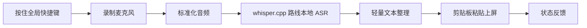

# VoxType MVP 技术方向

状态：已确认，等待实现计划和 scaffold。

## 背景

VoxType 的目标是做一个开源、Windows 优先、本地优先的语音输入工具。第一阶段要验证的核心体验是：按住快捷键说话，松开后本地转写，并把文字输入到当前光标位置。

第一轮需求整理和开源项目调研已完成，参考文档：

- `docs/research/requirements-brief.md`
- `docs/research/open-source-landscape.md`
- `docs/research/technical-options.md`
- `docs/research/mvp-technical-proposal.md`

## 已确认决策

- 技术栈：Rust + Tauri 2 + React/TypeScript。
- 平台优先级：Windows first。
- 语言目标：中文优先，兼容英文。
- ASR 路线：第一版优先走 whisper.cpp 路线。
- ASR 边界：必须保留 adapter，不把具体引擎写死进业务状态机。
- 上屏路线：第一版接受剪贴板粘贴并恢复原剪贴板。
- 上屏演进：后续按 `SendInput(KEYEVENTF_UNICODE)`、TSF 的顺序增强。
- UI 形态：第一版接受“托盘 + 设置页 + 状态提示”的工具形态。
- 隐私默认：音频默认留在本机，不上传。

## MVP 范围

MVP 要跑通一个稳定闭环：

MVP 应包含：

- Tauri 2 + React/TS + Rust 项目骨架。
- 全局 push-to-talk 快捷键。
- Rust 麦克风录音模块。
- 16 kHz mono PCM 音频标准化。
- whisper.cpp 路线 ASR 集成。
- 剪贴板粘贴并恢复原剪贴板的上屏策略。
- 托盘入口、设置页和状态提示。
- 基础错误处理：快捷键失败、麦克风失败、模型缺失、转写失败、上屏失败、剪贴板恢复失败。
- 基础测试和 README 开发命令。

## 非目标

- 不做完整 TSF IME 作为第一版。
- 不做会议录音、会议总结、说话人分离。
- 不做 AI agent、知识库或自动改写工作流。
- 不做云端识别作为默认路径。
- 不做 macOS/Linux 同步上线。
- 不复制 GPL/AGPL 调研项目源码。

## 上屏策略说明

上屏策略分三层演进：

1. 剪贴板粘贴：第一版使用。实现快，适合验证闭环，但要尽量恢复原剪贴板。
2. `SendInput(KEYEVENTF_UNICODE)`：第二阶段使用。绕开剪贴板，直接通过 Windows 输入 API 发送 Unicode 字符。
3. TSF：第三阶段评估。TSF 是 Windows Text Services Framework，更接近真正输入法集成，但复杂度高，不作为 MVP。

## 风险

- 剪贴板恢复可能失败，必须有错误提示和日志。
- whisper.cpp 路线的模型下载、模型路径、运行性能需要单独验证。
- Tauri overlay 或状态窗口可能抢焦点，MVP 状态提示必须保守。
- 全局快捷键可能冲突，需要防抖和失败提示。
- Windows 不同应用对粘贴和模拟输入的行为不同，需要手动 E2E 验证。

## 验收标准

- 能从 README 运行开发环境。
- 能在 Windows 上完成一次“按住、说话、松开、识别、上屏”。
- 默认不上传音频。
- 关键失败场景有可理解的错误提示。
- `bash init.sh` 和项目新增的格式化、测试命令通过。
